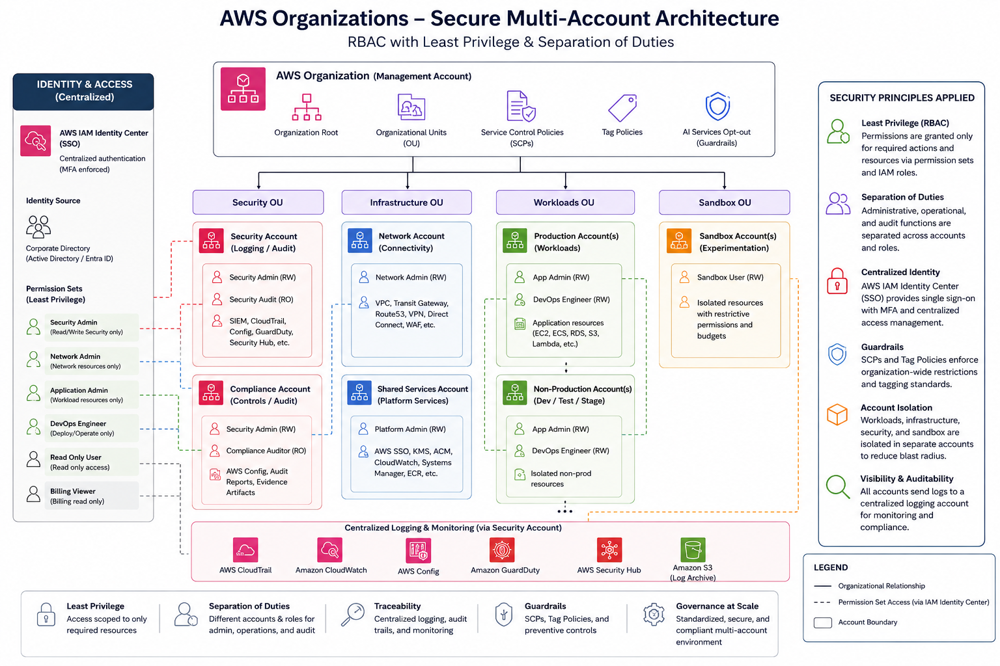
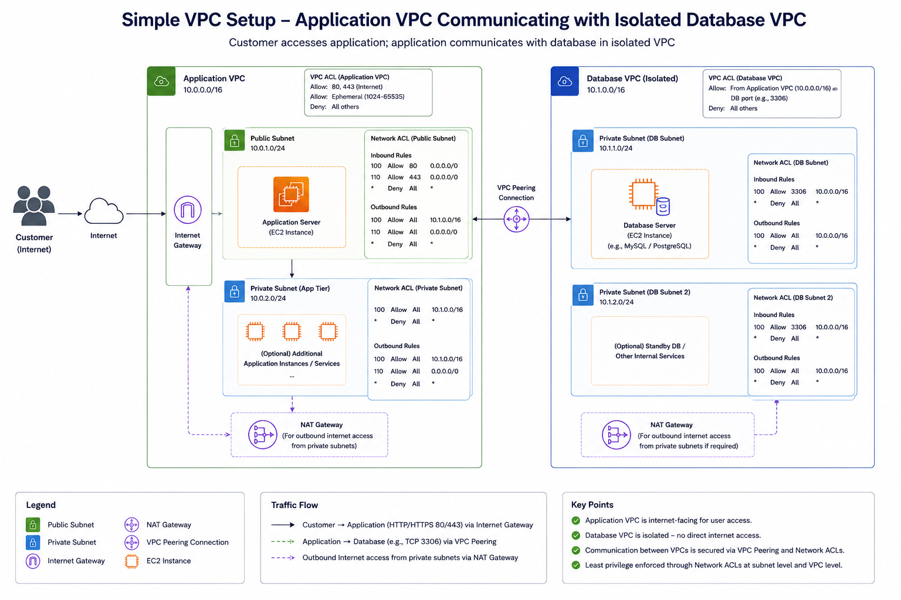
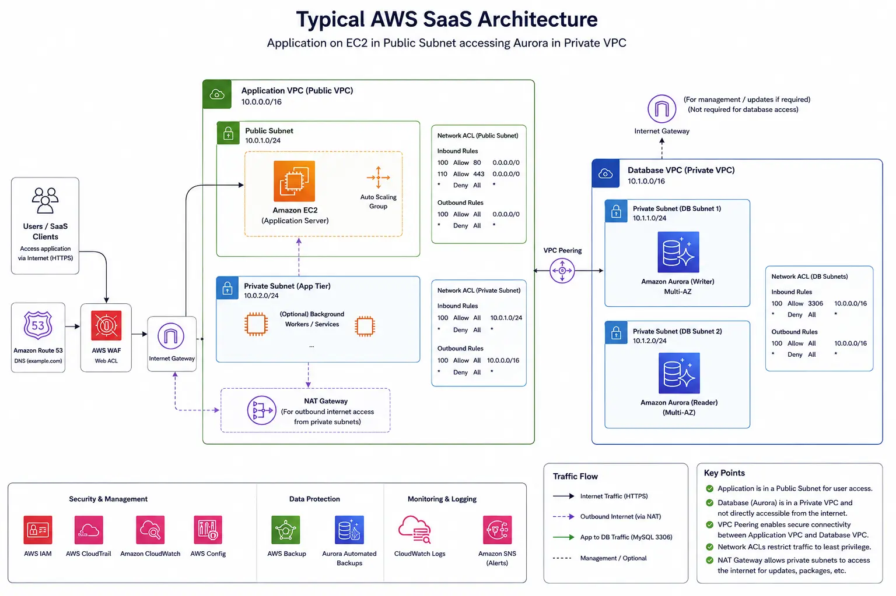

+++
title = "How I'd Help a Messy Mid SaaS Company Pass Audit Without Slowing Performance"
date = 2026-05-14T00:53:00+02:00
lastmod = 2026-05-14T00:53:00+02:00
description = "A practical SaaS case study on improving audit readiness, access controls, AWS architecture, and cost efficiency without sacrificing application performance."
summary = "A hypothetical engagement showing how a growing SaaS company could improve audit readiness, tighten AWS access controls, migrate away from risky database patterns, and reduce operational drag without slowing performance."
slug = "how-id-help-a-messy-mid-saas-company-pass-audit-without-slowing-performance"
tags = ["saas", "aws", "cloud-security", "audit-readiness", "iam", "least-privilege", "aurora", "cost-optimization", "security-architecture", "compliance"]
categories = ["saas", "cloud-security", "compliance"]
authors = ["mousa"]
draft = false
showTableOfContents = true
showTaxonomies = true
showWordCount = true
showReadingTime = true
showDate = true
showDateUpdated = true
showAuthor = true
showBreadcrumbs = true
showHeadingAnchors = true
showPagination = true
showSummary = true
sharingLinks = ["email","reddit","telegram","twitter","linkedin"]
+++

> [!NOTE]Disclaimer:
>This is a case scenario based on common real SaaS environments, not a
>single specific client. It shows how I would approach an engagement with
>similar challenges.

## Overview

### Company description:

**Size**: 200 employees

**Product**: Accounting services to both businesses and individuals

**Type**: SaaS

**Customers size**: Over 1 million customers in the US

**Age**: 5 years (startup phase)

During the early stages, the focus is more on delivery and shipping than
compliance. Unfortunately, many engineering teams stop at 2FA and think
that compliance issues are done. Compliance is often underestimated at
this stage because the business is assessing whether they will survive
or not.

Auditors often have requirements that are strict which doesn’t always
consider company’s current setup. This often causes teams to scramble to
gather evidence and screenshots to fulfill those requirements. More
often than not, this eats away time and resources and when it becomes a
daily or weekly occurrence, this impacts company’s performance.

One of the issues that auditors usually flag as high priority is proving
that users face no challenges or risks of requesting their data to be
securely accessed or deleted even after 1 year.

## Situation and Challenges

It happens that some early providers may develop applications that run
on-prem alongside a machine for the database which keeps growing over
time. When the company finally decides to migrate their database of
clients to the cloud, they simply create an EC2 instance with MySql and
keep vertically scaling the machine to accommodate higher request
volume.

The database could handle a huge number of requests, everything from
logging in to bloated tables of when clients logged in and logged out as
well as deletion requests.

Another requirement auditors often ask for is to keep track of who was
granted access to the production database as well as service accounts
that were used to handle automated tasks.

On top of that, companies receive an increasing number of complaints
about the service being slow the end user begins noticing that simple
tasks take a lot longer to finish. This can be temporarily solved by
upgrading the storage being used by their EC2 from EBS gp3 (SSD) to EBS
io2 (provisioned IOPS SSD).

After few weeks, clients complaints drop and positive feedback improve.
This may lead eventually for the new client’s base to increase by 10s of
thousands of accounts when least expected. This would lead to AWS bill
to exceed the budget prepared.

Many of these issues have little to do with the auditors or their
questions and more to do with very specific design issues and business
decisions that lead to a snowball effect creating all of these problems.

This situation unfortunately is more common than you think. Most
startups follow the MVP approach during early stages and their staff are
overwhelmed due to the limited resources; so serious security and cloud
expertise becomes more of an afterthought since at this phase, it’s
about survival, not about the best design and this is normal and
expected.

## Constraints

It’s easier said than done at this stage to say “Let’s just redesign the
whole SaaS” but for a business handling millions of accounts across the
United States, a small outage could raise serious problems or even hurt
the company’s reputation and lead to penalties since they have their own
SLA agreements with their clients.

We can’t simulate in a sandbox the deployment of a database with
millions of accounts and expect that things will be as smooth in
production.

We are also tempted to think about reducing the database’s size by
removing inactive accounts. While this approach may seem legit, the
problem is that the business expects people to access their accounts
once per year and with unexpected accounting delays, their clients may
go absent for over a year without accessing their account. Remember, the
auditors on this engagement emphasized that the clients need to be able
to access their data and account up to 10 years unless they explicitly
delete their accounts.

The auditors were also concerned about multiple teams having access to
the EC2 instance running the MySQL instance server without clear
protocols or procedures on who can access what. They don’t have
dedicated teams for each process.

## How I’d approach it

Here is where IDEA comes to the rescue!

IDEA is a 4 phase process to clean up the mess at any organization.

1- Inventory and discovery

2- Design (architecture and controls)

3- Execute (implementation)

4- Assure (evidence and continuous compliance)

-------------------

### Phase 1: Inventory and Discovery

The first step to take, is not actually a step but rather turning on a
flashlight because walking into the dark is not recommended.

During this phase, we first need inventory the data as well as map the
data flow. The data flow should be mapped from the collection/creation
till destruction. Labeling the data is extremely important because we
need to be able to tell which data needs proper protection.

There are tons of tools used for data discovery and classification but
this doesn’t come without risks because running those tools is also
going to task the infrastructure and if the tool is compromised, this
would kill the very reason we use them.

First, we survey the engineering teams to understand what data is being
stored and we have a look at sample data in their database and the most
important tables.

The survey will cover several areas such as the below:

- **Team & System Context**

- **Data Stores & Locations**

- **Data Types & Sensitivity**

- **Data Lifecycle**

- **Service Accounts & Automation**

- **Perceived Risks & Pain Points**

In more complicated cases where for example, data maybe stored in
unstructured or semi-structured manner and clients or customers are
throwing everything there from their financial data to their dogs’
pictures, we would need to use AWS Glue.

Once we have the data classified and labeled as well as a clear picture
of the data flow from collection till destruction, we can now move to
phase 2 and see how we could optimize or improve the situation for the
company.

>[!NOTE]Note:
>The reason we begin with this step is because in many cases, the company
>may or may not be aware what kind of data is being stored and such
>discovery would help us later on figure out who should have access to
>what.

### Phase 2: Design: Architecture and Controls

For accessing the AWS console, the company uses a typical groups based
IAM. Upon examining the groups structure they had, it turned out that
they had multiple groups that gave access to EC2 instances which other
staff and engineers didn’t actually need. This happened because all the
software application and database related access in prod was put in a
single group.

They integrated their company’s Active Directory to AWS to make sure
that when staff left the company, they would also be de-provisioned on
AWS. However, the major concern was that this process was not guaranteed
to run immediately; so employees who quit the company or terminated were
still active on AWS for up to 24 hours.

Below is how their IAM setup looks like:

```console
# BAD EXAMPLE – OVER‑PERMISSIVE, COARSE‑GRAINED GROUPS

# 1) One big “prod” group that mixes app + DB + EC2 access
aws iam create-group --group-name Prod-App-And-DB-Admins

# Attach a broad policy that gives console + EC2 + RDS + S3 + CloudWatch access in prod
aws iam attach-group-policy \
  --group-name Prod-App-And-DB-Admins \
  --policy-arn arn:aws:iam::aws:policy/PowerUserAccess
# (PowerUserAccess is already very broad – this is the first red flag.)

# 2) Re-using the same group for different roles (backend, frontend, ops, support)
aws iam add-user-to-group --group-name Prod-App-And-DB-Admins --user-name backend-dev-1
aws iam add-user-to-group --group-name Prod-App-And-DB-Admins --user-name backend-dev-2
aws iam add-user-to-group --group-name Prod-App-And-DB-Admins --user-name frontend-dev-1
aws iam add-user-to-group --group-name Prod-App-And-DB-Admins --user-name data-analyst-1
aws iam add-user-to-group --group-name Prod-App-And-DB-Admins --user-name support-engineer-1

# 3) A second “EC2 maintenance” group that is ALSO too broad,
#    but some users are in both groups, effectively giving them wide access to prod hosts.
aws iam create-group --group-name EC2-Maintenance-All-Prod

aws iam attach-group-policy \
  --group-name EC2-Maintenance-All-Prod \
  --policy-arn arn:aws:iam::aws:policy/AmazonEC2FullAccess

aws iam add-user-to-group --group-name EC2-Maintenance-All-Prod --user-name backend-dev-1
aws iam add-user-to-group --group-name EC2-Maintenance-All-Prod --user-name ops-engineer-1

# 4) Simulating AD / SSO user provisioning
# (conceptually: AD group “Prod-Staff” maps to this one big AWS IAM group)
# In practice this is done via identity provider mapping rules, but the effect is:
# - If you're in the AD group, you land in a very powerful AWS group.
# - Deprovisioning can lag up to 24 hours, so ex-employees can still assume these permissions.
```

-------------------------------------------

While their senior team members and staff engineers were aware of the
concept or term Least Privilege Access, this wasn’t something they
thought of at the beginning or during design phase because they were
running in Extreme Programming agile methodology during the first 1-2
years to speed up the development process.

### Phase 3: Execution

After a conversation with the Engineering Director, I’d propose applying
least access privilege policy company wide and obtain backing of
leadership.

Of course, we could not talk about least access privilege without
talking about Role Based Access Controls. We have to define the roles
and who does what and why.

We would perform an analysis over AWS CloudTrail events to determine
which users accessed what and why or what commands they were running
against which services.

From there, we created a model of roles with separation of duties and
dual controls on sensitive areas such as the AWS key management vaults.

Once this is approved, we would assign 2 admins to work together to
strip and re-assign access during the hours of least activity (the
weekend) with backup plans in case things went wrong.

While implementing this fix, we didn’t touch any running components.
It’s simply about addressing the access and security issues.

The final setup looked like this:



Before this would be rolled, we would invite a trusted auditor who would
assess the risk of this change given the legacy setup.

Once the quarterly review period kicks off, we would present all the
gains and wins accomplished within 2 months.

The overall, executive summary of the audit report was positive and
favorable.

The next problem that is bleeding the company is the optimization
problem.

The company setup before optimization was very simple. It looked like
this:



The company didn’t particularly have any significant problems in terms
of availability but the risk of things going wrong were very real.

They had regular backup processes and recovery procedures in case of an
outage.

They had properly defined Business Continuity and Disaster Recovery
process as well as RTO and RPO.

However, due to their architecture, they had to do a lot of supervised
tasks and processes to ensure that the database backup process was
running properly which ate away resources from the company indirectly in
terms of maintenance.

We identified several opportunities

#### Bottleneck 1: The Database running on EC2

Instead of running their database on an EC2 instance, we decided to
migrate their database to AWS Aurora V2 which can also run MySql. This
was the most smooth transition possible as it requires little to no code
changes except the applications’ connections destination and
credentials.

By using AWS’s Data Migration Service, we let it run against the current
database instance on EC2 for several days and it copies everything
including ongoing operations such as insertions, updates and deletions.

We would get 2 massive wins here:

1.  No code changes had to be made on services using the database except
    the path and credentials.

2.  Given that AWS Aurora V2 is a server less, this means we no longer
    have to worry about scalability and availability. AWS Aurora V2
    handles those questions on it’s own with almost near zero impact on
    performance.

3.  The engineering teams no longer have to spend their weekends on
    backup tasks as those are also handled by AWS Aurora V2.

>[!TIP]Bonus:
>Traceability and tracking of who has access to the database had been
>improved indirectly by this migration since access to the database
>doesn’t need to be managed manually like before on the EC2 instance.
>Instead, now we control who access the database via AWS’s roles and
>policies instead. Second, database logs can now be streamed via
>CloudWatch which makes them easier to search, monitor, and retain for
>audits.

#### Bottleneck 2: Huge amount of data on the databases

Now that we have safely moved our database from EC2 to Aurora V2, came
the next bottleneck which is the amount of data which we don’t actually
need to keep indefinitely.

Upon further examination, the company chose to store logging activities
into the database and considered it as meeting PCI DSS requirement which
does require strong logging. However, those logs didn’t actually need to
be stored in the database but instead, could have been shifted to much
cheaper alternative such as S3 buckets.

So we would propose to the Devs team to change their applications to
store those records instead in S3 bucket for each account in a simple
CSV file.

Upon further analysis, we saw that the number of E-discovery cases or
legal holds was very rare beyond the period of 3 months.

Once the team configured their applications to begin storing account
activities for auditing purposes in S3 instead of the database, we
migrated all the old records stored in the database into S3 as well.

We configured S3 to use S3 Lifecycle configuration where data is moved
after 2 years from Standard to S3 Glacier Instant Retrieval. We
configured it to move data after 2.5 years of inactivity into S3 Glacier
Flexible Retrieval which was perfect as both clients and third parties,
didn’t mind waiting few days to retrieve very old data.

We would get here the following wins:

- The cost of storing those logs was reduced by roughly 20% which was a
  significant win.

- Enabling versioning on S3 made the data also much more resilient to
  ransomware threats.

- Better software development practices where we decoupled the auditing
  requirements from the main service so now the SaaS focuses more on
  serving clients instead.

After those specific improvements, our architecture now looks like this:



### Phase 4: Assure: Evidence and Continuous Compliance

Throughout every project performed above, we followed an Agile approach
after defining the KPIs and goals or wins at each phase.

Before each change, we conduct a meeting with the stakeholders and
leadership to get a sign off as well as a simulated Business Recovery
and Disaster Recovery plan for possible risks at each phase.

The process would take roughly 3 months.

## Expected Impact

Such cost optimizations save companies roughly 20-40% in terms of
operations costs. The cost of deploying extra resources for
investigations due to less than ideal setups as well as rushed design
decisions can escalate over time and leads to both financial and even
liability for the company in case of a data breach.

>[!NOTE]Note:
>In the US, in some states, under specific sectors, there are regulations
>and notifications laws in case of breaches (impacting around 500
>customers or more) that require reporting to both authorities and public
>(media).

## How I can help

As a cloud security consultant and architect, I help SaaS teams like
yours discover hidden risks, reduce audit headaches, and optimize AWS
setup without interrupting performance. If this scenario feels familiar,
let’s talk about where you are today and what a safer, more efficient
architecture could look like for you.

[Book a short
call](https://calendly.com/contact-mousa-cloud-consulting/30min).

[Send me a note](https://tally.so/r/7R2PPZ)
