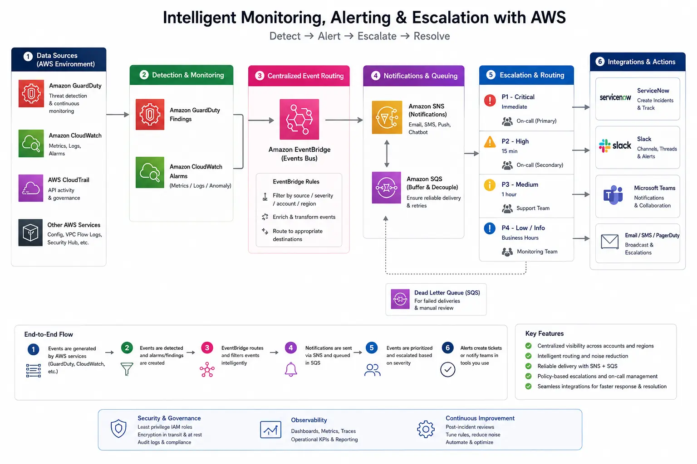

+++
title = "Why Turning On AWS GuardDuty Is Not Enough"
date = 2026-05-17T21:13:00+02:00
lastmod = 2026-05-17T21:13:00+02:00
description = "A hypothetical AWS case study showing why GuardDuty alone is not enough without proper monitoring, escalation, and incident response procedures."
summary = "A mid-sized SaaS company had AWS GuardDuty enabled, but an old unresolved alert exposed a deeper gap in cloud monitoring and incident response readiness."
slug = "why-turning-on-aws-guardduty-is-not-enough"
tags = ["aws", "guardduty", "cloud-security", "incident-response", "monitoring", "iso-27001", "devsecops"]
categories = ["aws", "cloud-security", "incident-response"]
authors = ["mousa"]
draft = false
showTableOfContents = true
showTaxonomies = true
showWordCount = true
showReadingTime = true
showDate = true
showDateUpdated = true
showAuthor = true
showBreadcrumbs = true
showHeadingAnchors = true
showPagination = true
showSummary = true
sharingLinks = ["email","reddit","telegram","twitter","linkedin"]
+++

> [!NOTE]Disclaimer:
>This is a hypothetical case scenario based on common AWS environments, past incidents and not about a particular company.

## Overview

Imagine a mid-sized SaaS provider in the US. The company provides customers with email marketing services and their clients are marketing agencies in the US.

The company uses AWS for its backend cloud operations and to process clients email marketing requests.

The company has a small trusted engineering team, and they never experienced before any security incidents or breaches; they normally focus on testing their services more than monitoring the infrastructure.

## Situation

As the digital landscape keeps evolving, the importance of the ISO 27001 became more compelling than ever before; so one day, the CEO asked the Engineering Lead to do what’s necessary to achieve ISO 27001.

The Engineering Lead called in an ISO 27001 external consultant. As the consultant began going through their checklist (ISO 27002), he asked about showing them what controls they have for AWS in regards to monitoring and incident response.

The Engineering Lead showed the consultant their AWS GuardDuty running as well as CloudWatch. The consultant noticed an alert in AWS GuardDuty that was not remediated yet. As the Engineering Lead was talking, he took a closer look at the alert and saw a warning about a suspicious API call made by an employee.

When he looked up the employee’s name in the company records, he found out that the employee left the company long time ago.

When he told the Engineering Lead, he was shocked, so he informed the DevOps team to check it out and report back on the matter.

They found out that the inactive employee was running a cron job before they were laid off to automate certain task related to data aggregation that was no longer valid or needed. The cron job wasn’t malicious but it was now risky.

This raised a lot of questions about the company’s monitoring and incident response controls since the alert was old but no one took action since it seemed that no one was really monitoring AWS GuardDuty and there was no proper notification channel.

## Constraints

While the company technically had AWS GuardDuty running, they lacked proper monitoring and incident response procedures in relation to cloud operations due to lack of expertise on the matter.

The company is a cloud customer or cloud consumer, so they thought that the responsibility of monitoring falls within the cloud service provider’s scope which goes against NIST’s Cloud Reference Architecture and ISO/IEC 17789. The cloud service providers are responsible of securing the cloud but the cloud consumers are responsible of securing what they build in the cloud.

The company’s cloud infrastructure was a blind spot.

## Approach

As a first step, I’d follow the **IDEA** approach to methodologically help the company fill this gap, so they can improve their odds of achieving the ISO 27001.

### Inventory

Upon checking what the company is using currently, we found the following:

• AWS GuardDuty (no notification or escalation configured)

• AWS Config

• AWS CloudWatch

• AWS CloudTrail (bloated with lots of events)

We have also created a list of all the services the company is running on EC2 (the web application instances) to make sure they’re probably integrated into AWS CloudWatch.

### Design

First and foremost, the company needs to have a policy in place regarding their cloud operations, responsibilities as well as monitoring and incident response procedures.

***Policy:***

 Infrastructure using cloud service providers require monitoring as well as remediation by the DevOps team to ensure business continuity and disaster recovery where applicable.

***Procedures:***

• All warnings and alerts need to be properly escalated through proper channels.

• Events and alerts on AWS need to be classified based on their known criteria and unknown problem should be investigated till they are classified.

• A team members needs to be on-call duty to monitor notification channels for any alerts or warnings from AWS GuardDuty, CloudWatch or others based on events’ rules configured via AWS EventBridge 24/7 (rotated between team members).

• There should be a central NOC channel used by the DevOps and other related stakeholders to monitor for any anomalies or warnings.

• The team needs to tidy up the logs or alerts that are known problems to prevent alert fatigue. (Achieved by properly classifying alerts).

• The concerned teams need to train the staff by simulating scenarios that are risky and likely to happen using techniques that are available or convenient such as Tabletop, cyber-drills,red vs. blue team,etc… 

A concrete design for monitoring AWS in our case would look like this:

### Execute

Since we have already laid out the design or proper plan for improving the company’s posture in regards to cloud monitoring and incident response, the execution is what matters most.

#### Phase 1:

Before this phase, the management should have already defined the roles and responsibilities of who will inherit the duties of monitoring cloud operations (usually DevSecOps Team members).

There is no point of enabling notifications if there is a huge number of false positives or alerts of known problems as they will only generate alerts fatigue and shadow more concerning ones which may slow down response or even worse missing it altogether.

The goal of this phase, is to run an analysis on all the alerts and warnings in all services and identify which patterns are informational, warnings, known problems, past incidents, etc…

#### Phase 2:

Next, we will now setup EventBridge in AWS for each AWS service with proper SNS/SQS and notification channels (same as in diagram 1) but only for the type of events we care about.

We will setup also a separate channel for unknown problems or new alerts.

> [!TIP]Bonus:
>If the company is storing data in S3, AWS Macie can be wired to EventBridge in order to notify in case of any content that violates company terms or exposes the company to legal risks.

#### Phase 3:

Finally, in this phase, we are going to make sure that our new notification channels are working (e.g. Slack) and that the team are able to identify problems that needs attention and that the notifications aren’t being too disruptive, overly repetitive or confusing.

#### Phase 4 (optional):
Now that we have a proper escalation procedures to respond to incidents prospectively, your team probably have missed other warnings or alerts in the past. Whether or not you’d like your team to retrospectively go back and remediate all past alerts can be helpful but you’ll most likely encounter a lot of alerts that may no longer be valid or issues that the team have actually remediated without knowing that they did.

### Assure
To make sure that the team’s incident response plan works, we need to remember that to many DevSecOps teams are working on important business deliverables such as production deployments, testing, pipelines, etc… so it won’t be enough to setup a policy and call it a day.

To make sure that the DevSecOps teams’ attention span still have some space for our new M & IR, we will schedule trainings in coordination with leaders on quarterly basis that adapt to ongoing problems or new incidents so both old team members and new ones are prepared.

We can get creative here as mentioned earlier, we have the following techniques. There is no single perfect technique, so organizations need to explore what works best for them since time and resources aren’t always a luxury:

• Tabletop exercises: Simulate a scenario in a quiz like meeting with brain teasers.

• Cyber drills: Simulate a real incident from past ones and help train team members on where to look and how to escalate.

• Blue vs. Red team: Red team simulates what a real attacker would do and blue team responds.

• Purple team exercises: Red and blue team work together collaboratively to understand how to spot and respond to specific incidents.

The company may already have monitoring and incident response plans, but more often than not, younger companies or startups, may lack the expertise specifically in relation to cloud despite the resources that most cloud providers such as AWS provide (AWS consultants) because they can be expensive and not every one in your DevSecOps teams will be trained particularly on such high level problems and governance related methodologies.

## Impact

With our plan, we have achieved multiple wins:

• The team now have a structured approach to responding to problems.

• Better traceability and accountability.

• Reduced costs by responding earlier to either malicious activities or misconfigurations before they become full incidents.

• Better controls that contribute better towards the ISO 27001 (and also checks ISO 27002).

• Reducing potential downtime or risk of downtime for the company’s customers or clients.
           
## How I can help

As a cloud security consultant and architect, I help SaaS teams like yours discover hidden risks, reduce audit headaches, and optimize AWS setup without interrupting performance. If this scenario feels familiar, let’s talk about where you are today and what a safer, more efficient architecture could look like for you.

[Book a short call.](https://calendly.com/contact-mousa-cloud-consulting/30min)

[Send me a note](https://tally.so/r/7R2PPZ)