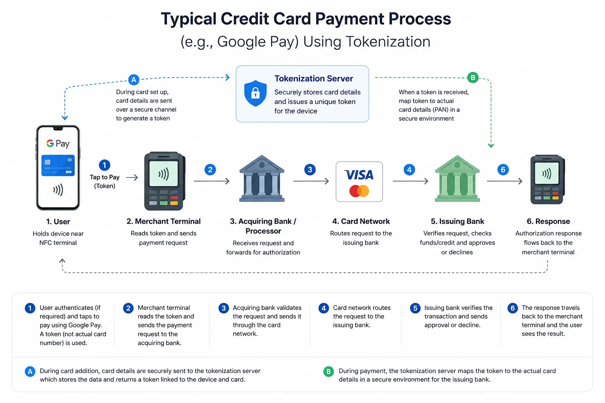

+++
title = "How Tokenization Reduces Merchants' PCI Scope"
date = 2026-05-11T21:18:00+02:00
lastmod = 2026-05-11T21:18:00+02:00
description = "An overview of how tokenization reduces PCI scope, lowers payment data exposure, and helps merchants simplify compliance and security operations."
summary = "A practical explanation of how tokenization reduces merchants’ PCI scope by limiting cardholder data exposure and shifting sensitive payment handling away from merchant systems."
slug = "how-tokenization-reduces-merchants-pci-scope"
tags = ["pci-dss", "tokenization", "payments", "cloud-security", "security-architecture", "compliance"]
categories = ["payments", "compliance", "security-architecture"]
authors = ["mousa"]
draft = false
showTableOfContents = true
showTaxonomies = true
showWordCount = true
showReadingTime = true
showDate = true
showDateUpdated = true
showAuthor = true
showBreadcrumbs = true
showHeadingAnchors = true
showPagination = true
showSummary = true
sharingLinks = ["email","reddit","telegram","twitter","linkedin"]
+++

> 

Tokenization is the process of replacing sensitive data (PII, financial, etc…) with a token.

Tokens are generated using secure random generators so it is extremely difficult for an attacker to steal a token and reverse engineer it unless the random generator at the TSP side has a major vulnerability or misconfigured. Please note that token generation methods vary by TSP.

The benefit of storing tokens is that it reduces significantly the attack vector. The risk of a stolen credit card information far exceeds the cost of setting up the infrastructure and compute power needed to generate the tokens.

In practice, there are nowadays many providers such as Alipay, Google Pay, Samsung Wallet, etc… for such services.

When a payer performs a transaction (using a terminal), the device transmits the DPAN (Device Primary Account Number), usually via NFC, along with other metadata over a protected channel to the Token Service Provider (TSP). On the provider’s side, the backend will de-tokenize the DPAN and forward a payment request to the issuing bank. Once the issuing bank authorizes the payment, a response is sent back to the merchant containing the tokenized transaction information which can be used for accounting purposes or handling disputes.

Throughout the process, the merchant never has to collect or store sensitive information such as credit card numbers which significantly reduces compliance friction as well as overall costs. 

Of course, the communication is protected by transport security and payment network controls but merchants need to make sure that they are using secure devices since they are physically the single point of failure. However, the process is generally more secure than handling credit cards directly and reduces costs of disputes as well as insurance claims.

The process may seem simple, yet it’s actually very useful for merchants because merchants have less operational burdens to worry about since the cost of protecting credit card information and compliance can be very expensive especially for startups or small businesses.

> [!NOTE]
>Please note that tokenization is nothing new. It is used not only for security and PCI compliance, but it’s used as well by many organizations when they have the flexibility to replace information they would have to invest time and money to protect with tokens.

As a Cloud Consultant, I help companies deal with similar PCI related problems they struggle with since there are over 200 requirements and sub-requirements under PCI DSS. The real challenge that companies face is figuring out whether the return of integrating those payment solutions justifies the cost; and sometimes, this comes as an answer after an unfavorable audit outcome regarding PCI compliance. When I engage with merchants, I help their teams quantify the costs and benefits by identifying potential revenue earned from clients who are accustomed to NFC payments vs. the cost of building and maintaining the infrastructure needed on their Backend using MVP approach first with Secure Development Life Cycles in mind.

If you’re considering integrating payment solutions or struggling with PCI requirements, you can learn more about my cloud and cybersecurity services in my bio or the link below.
https://www.mousa-cloud.com
