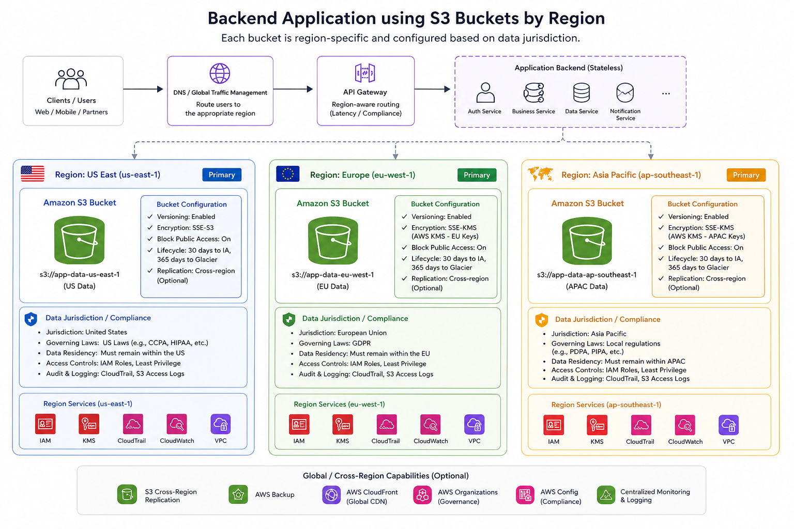

+++
title = "S3 Misconfiguration Still Top Risk in 2026: Case Study and Fixes for SaaS Providers"
date = 2026-05-15T05:27:00+02:00
draft = false
description = "A hypothetical case study showing how an S3 misconfiguration, public object exposure, and US-only storage created security and GDPR risks for a SaaS provider, and how to remediate them."
summary = "A hypothetical AWS case study on S3 public exposure, EU data residency gaps, and a phased remediation approach using presigned URLs, regional buckets, replication, versioning, and object lock."
tags = ["aws", "amazon-s3", "cloud-security", "gdpr", "data-residency", "pci", "saas", "incident-response"]
categories = ["aws", "security-architecture", "compliance"]
authors = ["mousa"]
showTableOfContents = true
showTaxonomies = true
showWordCount = true
showReadingTime = true
+++

> [!NOTE]Disclaimer:
>This is a hypothetical case scenario based on common AWS environments, past incidents and not about a particular company.

## Overview

Imagine a mid-sized SaaS provider based in the United States serving clients globally including the EU.

The company provides customer-friendly file storage and sharing services with AWS S3 buckets at its backbone.

They started off as US focused company and after few years, they decided to begin offering services to the EU.

Since they were testing the waters, they didn’t account yet for EU’s complex regulatory landscape and GDPR related matters.

## Situation

Their EU based QA team, found 2 problems during testing that required urgent escalation to management and engineering team in the US.

They found out that all customer uploaded files and data were stored in us-east-1 alongside all US customers’ data. 

They also found that if an attacker crawled the S3 bucket’s domain address, there was no protection layer for the files and that anyone could access uploaded files if they figure out what the object URL is. 

This was immediately escalated to legal and leadership team because under GDPR, if this would qualify as personal data breach, then the supervisory authority needs to be notified within 72 hours.

Luckily, the company’s insurer covered the costs associated with the incident such as legal, forensic and notification, and they didn’t have yet a large enough customer base in the EU but this led the company to bring an expert to fix the breach.1

## Constraints

The company identified the following challenges to remediate this breach.

1. The EU and US have different regulatory requirements in relation to data retention which was not planned for at the beginning.
2. The company’s marketing materials stated to EU clients that their data are stored within the EU when in fact, it is not. Creating a bucket in the EU and moving files there won’t happen overnight and requires a phased approach with proper testing to avoid outages or creating further compliance challenges.

## Approach

For such an engagement, I’d follow IDEA (Inventory, Design, Execute and Assure)

### Inventory
• List all S3 buckets and their current configurations and applied ACL as well policies.
• List S3 buckets that contain EU customers’ data.
• Verify how the objects are being accessed by the client side.

### Design

In terms of design, we will need to redesign the service to be more granular by having multiple S3 buckets per region with its own policies. This would help reduce the amount of backend development needed to address the problem.

The backend can simply change the destination bucket depending on customer’s location. Everything else could remain the same to maintain the customer’s current experience.

In regards to customers needing to have access to their data and request deletion, this can be a feature useful regardless of the region.
Therefore, our new design would look like below:

This way, whenever a change in regulations happen in regards to data retention for example, or needing to place a legal hold on certain customer’s objects, this becomes more dynamic than before.

### Execute

Once we would identify all the above, we will need to implement the following steps where applicable to remediate the breach:

1. The backend application need to be coded to use presigned URLs for each object in S3 instead of simply storing public URLs.
2. Create a new S3 bucket within the EU (e.g. eu-west-1) and configure S3 Batch Replication for identified EU customers objects’ paths only.
3. Redirect all new EU requests to use EU S3 bucket.
4. Make sure that all S3 buckets have “Block public access” enabled.
5. Make sure that versioning is enabled for each S3 bucket.
6. Once we verified the above, then we need to enable object lock and use Compliance Mode.

Throughout the process, each step is well planned and tested first in a sandbox environment before rolling in the changes.

While the steps are simple and iterations are short, each change must be properly documented and customers need to be let know in advance in case they will be impacted.

### Assure

By following a well planned agile approach, we would setup proper milestones after defining each success metric for steps implemented.

Leadership will be updated on regular basis via weekly teams updates as well as demos as evidence of changes implemented.

### Impact

With the above changes implemented, it will have the following wins:

• By using pre-signed URLs and blocking public access, this would help improve security so the objects are accessed only by the customer themselves and if pre-signed URLs are configured with short expiry, this would dramatically lower exposure.
• By having S3 bucket per region, we would be able to dynamically configure each bucket to be in compliance with the given region such as respecting data retention requirements.
• This design makes it also easy to onboard other regions.

> [!NOTE]Bonus:
>Since data retention and compliance requires enabling versioning by default in S3, this also hardens the security posture because with proper versioning and object locking, this dramatically reduces the risk of ransomware threats.

## How I can help

As a cloud security consultant and architect, I help SaaS teams like yours discover hidden risks, reduce audit headaches, and optimize AWS setup without interrupting performance. If this scenario feels familiar, let’s talk about where you are today and what a safer, more efficient architecture could look like for you.

[Book a short call.](https://calendly.com/contact-mousa-cloud-consulting/30min)

[Send me a note](https://tally.so/r/7R2PPZ)