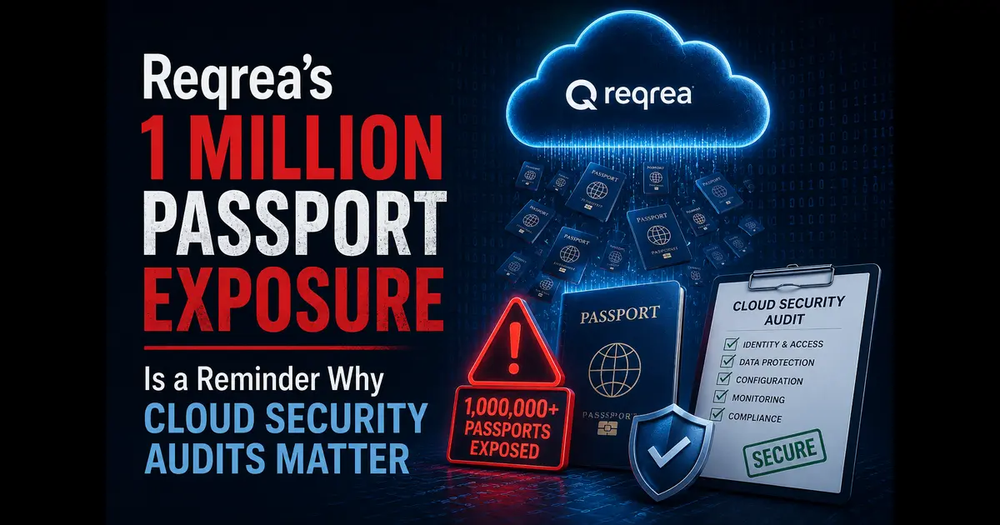
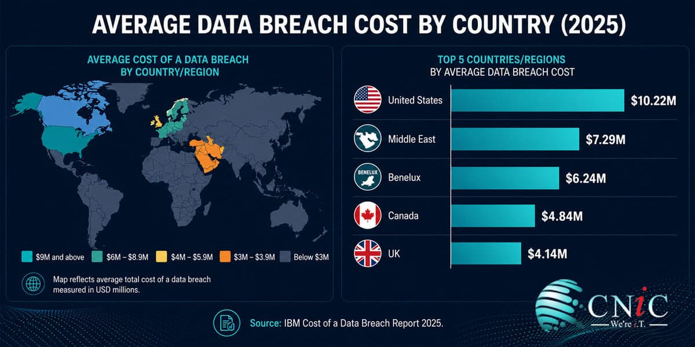

+++
title = "Reqrea’s 1 Million Passport Exposure Is a Reminder Why Cloud Security Audits Matter"
description = "This post examines the Reqrea/Tabiq incident, where a publicly accessible cloud storage bucket exposed more than 1 million passport and identity document records, and why it is a reminder that security audits are critical."
summary = "An analysis of the Reqrea/Tabiq incident and why it reinforces the importance of regular security audits in cloud environments."
draft = false
showReadingTime = true
showWordCount = true
showTaxonomies = true
date = 2026-06-29T00:00:00+02:00
tags = ["Cloud Security", "Data Breach", "Identity Security", "AWS", "Misconfiguration", "Security Audit", "Privacy"]
categories = ["Cloud Security", "Incident Analysis", "Data Breaches"]
showTableOfContents = true
showDate = true
showDateUpdated = true
showAuthor = true
showBreadcrumbs = true
showHeadingAnchors = true
showPagination = true
showSummary = true
sharingLinks = ["email","reddit","telegram","twitter","linkedin"]
+++

> 

### Incident

On May 15, 2026, Reqrea, a Japan-based KYC company, reported that more than 1 million passports had been exposed to the public internet via a misconfigured S3 bucket.

This breach impacted over 1 million travelers from around the world. Exposed passports could potentially put all impacted individuals at risk of identity theft or sophisticated social engineering attacks in the future.

This recent incident further confirms my point in the past that AWS misconfigurations remain one of the top cybersecurity vulnerabilities in 2026.

### How it was identified

The vulnerability was discovered by security researcher Anurag Sen, who detected that one of the S3 buckets used by the company was accessible to the public without authentication or an authorization process.

### Why it matters

KYC platforms and companies handling PII are expected to have strong change control, security governance and regular security audits to prevent such costly mistakes from happening. In this instance, since Reqrea has collected such data, they may face regulatory, contractual, and reputational exposure.

Unfortunately, such cases could potentially harm companies' reputation among customers and partners, which could hurt future sales.

>[!NOTE]
>The average data breach costs U.S. organizations about USD 10.22 million, according to IBM’s 2025 Cost of a Data Breach Report.
>

### Lesson Learned

Companies handling PII need to adopt "Secure by Design" policy and have strong cloud governance if they want to use cloud solutions.

A good preventive strategy would entail companies bringing in third parties (e.g. consultants) before going live or before getting involved in any activity involving protected data collection or transmission of such data.

Another lesson learned is that delegating KYC to third parties may actually reduce security if the KYC platform itself is insecure.

I can easily point out the fix needed for this vulnerability. However, we have to look at this incident or vulnerability rather as a question of governance and policies first and technical as second.