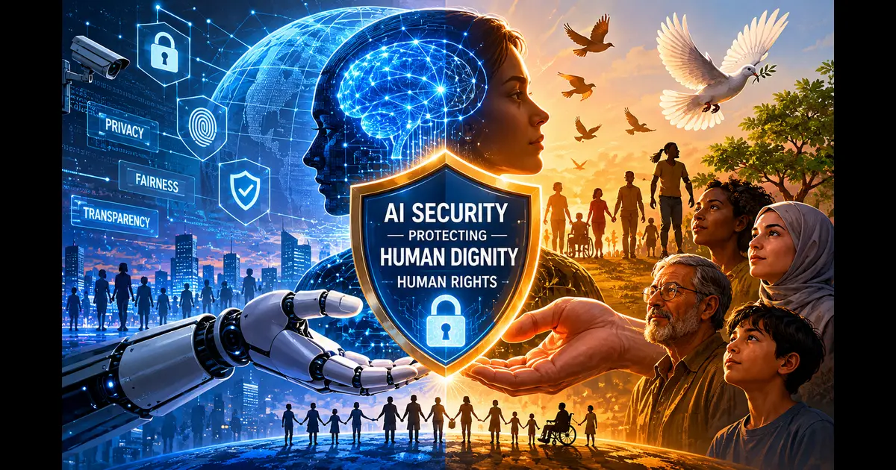

+++
title= "OWASP's Duty to Human Rights: Why AI Security Matters for Human Dignity"
description= "This post explores whether OWASP has a duty to human rights, examining how AI security intersects with human rights protection and why security professionals must consider real-world impact on vulnerable populations."
summary= "An exploration of OWASP's duty to human rights and why AI security matters for protecting vulnerable populations."
draft= false
showReadingTime = true
showWordCount = true
showTaxonomies = true
date = 2026-06-04T03:17:00+02:00
tags = ["OWASP", "Human Rights", "Cloud Security", "AI Security", "Ethics", "Software Security", "AI Governance"]
categories = ["Thought Pieces", "Cloud Security", "AI Governance"]
showTableOfContents = true
showDate = true
showDateUpdated = true
showAuthor = true
showBreadcrumbs = true
showHeadingAnchors = true
showPagination = true
showSummary = true
sharingLinks = ["email","reddit","telegram","twitter","linkedin"]
+++

## AI's Rapid Growth and Lack of Regulation

AI security is not only about protecting passwords and secrets, but it's about ensuring human safety first and foremost just as in software security in general.

We have seen recent years how AI has been rapidly expanding and similar to the internet at the beginning, the legal and regulatory bodies were still catching up; we are seeing at the moment a similar pattern taking place. Despite the fact that we have seen new standards and frameworks (e.g. NIST AI RMF) addressing the need for more responsible and safe AI usage, there are still a lot of concerns about which direction AI is going while corporations are rapidly pushing AI development to race the regulators instead of coordinating with regulators on what's acceptable and what not.

We have seen recently several instances where AI solutions have been used recklessly by certain organizations without proper controls or testing which led to several tragic incidents and loss of lives.

>[!NOTE]
>A perfect example of AI-caused loss of lives is Tesla's autopilot fatal crashes which so far led to 467 crashes, 54 injuries and 14 deaths. This is according to NHTSA's updated findings.
>[Read the full PBS article on NHTSA's investigation](https://www.pbs.org/newshour/nation/u-s-opens-new-investigation-into-teslas-full-self-driving-system-after-fatal-crash)

## OWASP & AI

According to OWASP AI Testing Guide, human oversight is required to ensure safety and security of any AI-based products or solutions. This is implemented by having several human-in-the-loop checkpoints for any critical AI decisions as well as proper monitoring and logging of any human intervention.

In addition, there have been rising concerns of bias since LLMs can be biased depending on what training data they have been fed. This is why it must be ensured that LLMs are tested against bias. [Check OWASP Top 10 for LLM Applications](https://owasp.org/www-project-top-ten-for-llm-applications/)

## Overconfidence Challenge

Overconfidence in AI will remain one of the biggest challenges to address since a lot of organizations jumped into the AI wagon without assessing the organization's AI maturity and without structured governance framework and policies in place.

AI models and LLMs do make mistakes and do have flaws and over-reliance on AI, especially in sensitive situations, could lead to catastrophic consequences.

While AI has definitely made it easier for malicious actors to compromise software, we should not forget that OWASP has a duty as well to prevent AI from being used in ways that may violate human rights or compromise human dignity.

Will the EU AI Act address the long sought after answers?

What do you think that we as cybersecurity practitioners can do to fill in the gaps and go above and beyond to prevent AI from ever being used in a way that could compromise safety and human life?