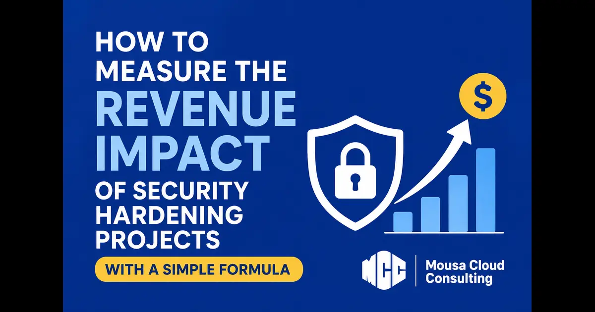

+++
title = "How to Measure the Revenue Impact of Security Hardening Projects with a Simple Formula"
description = "This post explains practical ways to measure the revenue impact of security hardening projects, including risk reduction, deal enablement, customer trust, and reduced sales friction."
summary = "A practical guide to measuring the business value of security hardening projects in revenue terms."
draft = false
showReadingTime = true
showWordCount = true
showTaxonomies = true
date = 2026-07-16T00:00:00+02:00
tags = ["Cloud Security", "Security ROI", "Revenue Attribution", "Security Hardening", "Risk Management", "Business Value", "AWS"]
categories = ["Cloud Security", "Security Strategy", "Business Impact"]
showTableOfContents = true
showDate = true
showDateUpdated = true
showAuthor = true
showBreadcrumbs = true
showHeadingAnchors = true
showPagination = true
showSummary = true
sharingLinks = ["email","reddit","telegram","twitter","linkedin"]
+++

> 

One of the main challenges that leaders face when pitching a security hardening project is putting a quantifiable value on it to justify the budget to their partners and shareholders.

While compliance and regulations do incentivize investing in security hardening efforts for infrastructure or the company's products and services, more often than not they are viewed as a checkbox rather than a necessary regular practice.

Many leaders are well aware of the importance of regular security hardening projects, but it's not always simple to ask for a budget for activities that do not generate direct revenue.

In this article, we will explore a simple formula that fills this gap.

> [!TIP]
> I’ve created an anonymous calculator page that you can use to test ALE and see how it works in practice. To access the calculator, [click here](https://www.mousa-cloud.com/ale-loss-calculator)

## Annualized Loss Expectancy (ALE)

ALE (annualized loss expectancy) is a formula that combines asset value, exposure factor, and annual rate of occurrence to help estimate future losses for a specific asset on an annual basis. Please note that the more historical data is available involving incidents and losses caused by such incidents, the more reliable it becomes.

> ALE = (Asset Value × Exposure Factor) × Annual Rate of Occurrence

To calculate ALE, we first need to know the exposure factor of the asset in question and the annual rate of occurrence.

### Exposure Factor (EF)

The exposure factor is an estimate of the percentage of the asset value lost in one incident. As an example, imagine that you have a car worth a total of USD 10k. If, for example, the bumper of the car costs USD 1k to replace in case of damage, then the exposure factor is EF = 1000\$/10,000\$ = 10%.

> EF = asset impacted value / asset total value

In plain language, if a certain vulnerability or risk only damages an asset partially, then EF is useful to estimate the impacted value of the asset.

### Annual Rate of Occurrence (ARO)

The annualized rate of occurrence (ARO) is a straightforward variable. If, for example, a car has an accident in the same spot twice within the fiscal year, then the ARO would be 2.

## Example Application

In 2025, the security team compiled a report summarizing the operations of their ATM machines, including cash lost due to errors or hackers exploiting hardware vulnerabilities.

In 2025, one of the ATM machines, holding a total cash value of USD 100k spread over different bill amounts, experienced 10 incidents that were not immediately detected. The incident involved a vulnerability in the ATM software, a glitch that would cause the machine to hand out double the amount of cash requested.

The hacker exploited a vulnerability in the ATM's software that allowed him to withdraw double the amount of bills requested. This vulnerability only works when the user or client requests that the cash is paid in USD 1k bills. Assuming that the ATM is always refilled to maintain a total value of USD 100k, how would you calculate expected loss?

Given the information we have, we need to prepare a prediction of similar incidents if the ATM software is not hardened.

> [!TIP]  
> Sometimes, organizations choose to accept risks if the cost of remediation far exceeds the loss.

### Exposure Factor

We first need to figure out what the exposure factor is. Given that in our scenario the bug only impacts the USD 1k bills, let's assume that our ATM contains a total of USD 30k in USD 1k bills.

In this case, the exposure factor would be calculated as follows:

USD 30k (total cash value of the USD 1k bills in the machine) / USD 100k (total cash value in the machine) = 0.30 (or 30%)

### Annual Rate of Occurrence

Given that the same incident happened a total of 10 times in 2025, the ARO = 10.

### Annualized Loss Expectancy

ALE = 100k (total asset value) × 0.30 (Exposure Factor) × 10 (Annual Rate of Occurrence)

The result is USD 300k per year.

## Fix Vs. Document

Now, leadership is going to assess whether to invest in fixing the software bug or accept it as is. The Engineering Director estimated that fixing the bug would cost around USD 100k to hire an ATM software specialist who would patch all the ATMs.

In this scenario, since the difference between USD 300k and USD 100k is significant enough, it makes sense to invest in fixing the ATM software bug.

> [!NOTE]  
> Please note that if the ATM bug only impacted the USD 1 bills (all else constant), the result would have been totally different.

From a governance and risk strategy perspective, if the cost of tightening security controls would be higher than the expected losses, it can be accepted as a risk and documented based on the ALE metric. The security teams can monitor the ALE and, if the pattern or cost becomes clearly higher, then it would trigger a re-evaluation of whether or not to invest in the security hardening effort.

If leadership decides to accept the risk or vulnerability, it is essential to document the risk or vulnerability, as well as the ALE, thoroughly. This strengthens governance and supports trust in external assurance reports, such as SOC 2 Type II or similar attestations.

> [!IMPORTANT]
> In practice, this means we are choosing between spending USD 100k once to reduce a USD 300k yearly exposure, or formally accepting that exposure and explaining why it is consistent with our risk appetite.

## Conclusion

The ALE formula is extremely useful not only for measuring future losses projected from historical incidents but also for helping define the risk strategy that would be suitable based on quantifiable measures.