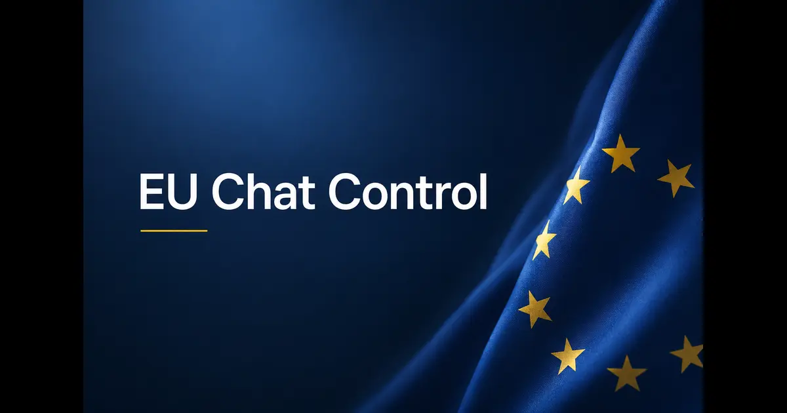

+++
title = "EU's Controversial Chat Control Amendment Passed and Potential Security Implications"
description = "This post examines the EU's controversial Chat Control amendment, what it changes about voluntary scanning and age verification, and the security, privacy, and encryption implications for users, platforms, and digital infrastructure."
summary = "An analysis of the EU's Chat Control amendment and its broader impact on privacy, encryption, and cloud security."
draft = false
showReadingTime = true
showWordCount = true
showTaxonomies = true
date = 2026-07-13T00:00:00+02:00
tags = ["EU Policy", "Chat Control", "Privacy", "Encryption", "Cloud Security", "Surveillance", "Security Audit"]
categories = ["Policy Analysis", "Cloud Security", "Privacy"]
showTableOfContents = true
showDate = true
showDateUpdated = true
showAuthor = true
showBreadcrumbs = true
showHeadingAnchors = true
showPagination = true
showSummary = true
sharingLinks = ["email","reddit","telegram","twitter","linkedin"]
+++

> 

On July 3rd, 2026, a controversial amendment was passed to an already controversial legislation described by many as a normalization of mass surveillance and undermining legitimate users' privacy online. In this article, we will dive deeper into the security implications for messaging service platforms.

### Scanning User Messages

As per the new amendment that was passed, platforms will be able to voluntarily scan user messages that are not encrypted end-to-end for any material involving child sexual abuse. This means messaging platforms like those on mainstream social media will be able to run scans over private messages between users, including photos, texts, and maybe even videos, to detect any potentially illegal material.

In practice, messaging platforms now have a legal basis to read private messages between users and hide behind the new amendment.

### How?

The big question is more technical rather than legal. However, the implications can be severe for both users and platforms, especially if platforms don't have a properly structured solution.

The most obvious solution that comes to mind is that they could create a cadence for running all the stored messages to be scanned by an LLM solution and configure alerts for any content that could raise red flags to be reviewed by the platform and potentially reported and delivered to the corresponding authorities either through a legal team or a dedicated platform. I'm not aware at the moment of any platforms that are made for such a purpose, but I'm speculating how this could work in practice.

If private user messages are encrypted at rest, this means there will also be a considerable computing cost for platforms to decrypt the content during the scanning periods.

If we take Telegram as an example, Telegram claims that they deliver 15 billion messages per day as of July 13, 2026. We do not know how many of those messages belong to their secret chat feature, so let's assume that the majority of the messages are not encrypted end-to-end.

### Technical Risks

If we assume that platforms will rely on LLM-based solutions, we have to discuss the risks.

#### AI False Positives and Bias

LLMs do make mistakes. This is why NIST AI RMF as well as OWASP Top 10 AI Security and Governance standards require human-in-the-loop for sensitive decisions. While human-in-the-loop is considered a best practice for sensitive decisions, bringing AI into the mix also brings with it all the common risks, including overconfidence, LLM bias, and drift.

Just running an AI scan doesn't mean that it will always properly classify the content. AI would be great for existing content but not for new content if AI isn't trained for it.

#### Scanning Tools

Effective scanning solutions are usually vendor-provided and bring with them their own risks, since any mistake on the vendor's side could expose all users' private data and even cause a data breach. Scanning tools that use LLM integrations require exposing the decrypted users' private messages to an external party. If not handled securely on both ends of the process (platform and vendor), the risk and potential of data breaches increases further.

#### Average Users Think Messages Are Private

Let's be honest. The majority of platform users aren't technical. I have personally encountered countless people who use private messages to store secrets such as credit card numbers, passwords, and other personal and sensitive content.

Platforms have no way to prevent users from using private messages in that capacity, and this is why platforms do not have the incentive to scan users' messages in the first place, as this would arguably impact their profits as well as expose them to legal liabilities.

### Alternative Solutions

One way in which platforms could perform a scan without compromising users' privacy (at least before an alert is triggered) is to instead perform hash-based comparisons.

If platforms have specific files or texts to monitor for, they could compare the hashes instead of the decrypted content.

### There Is No Perfect Solution

Even if we deploy hash-based detection instead of scanning users' private messages, the compute cost would be huge because not only do some platforms have to keep content encrypted at rest but also run hashing algorithm comparisons to detect the content in question if it exists.

Hashing also can be useful only for common or known content. So hashing wouldn't be that useful to spot modified content.

AI could do slightly better in terms of spotting patterns. However, this takes us again into the issues and risks mentioned earlier.

### Environmental Impact

The sheer volume of messages exchanged daily globally between users is already stressing data centers that are trying to expand their capacity to accommodate both regular companies' needs as well as AI.

The carbon footprint of scanning users' private messages at scale will only increase the burden on an already heating planet.

### Ethical Considerations

Relying on AI LLMs to flag users could have severe consequences on human rights if someone is flagged or accused of something illegal by mistake or by error. Even with human-in-the-loop, human biases could also lead to discrimination and bias based on the user's legally protected traits such as language, nationality, or religion.

The fact that human intervention might be needed (platform's forensic or security teams) to manually review flagged content and potentially users' private conversations raises serious implications for users' privacy. Just because an AI flagged a certain user's messages doesn't mean that they are automatically guilty.

In edge cases, users might accidentally share content that may seem, at surface, like a meme and end up in criminal prosecution. The accusation alone could have severe implications on a person's life in terms of society, their own family, and more.

### Alternative Solutions

In my opinion, all children deserve protection. Violation of privacy of individuals or groups online is not protection in the pure sense. A more effective strategy to combat child abuse is by grassroots movements, awareness campaigns, and better legislation that addresses structural problems such as inequality and domestic violence.

### Useful Sources

https://oeil.europarl.europa.eu/oeil/en/document-summary?id=1891790

https://telegram.org/blog/100-million
