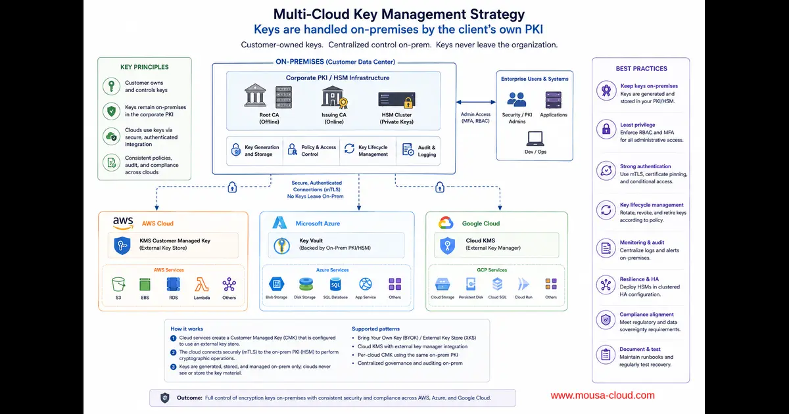

+++
title= "How Do You Protect Privacy & Security in Cloud Platforms Amid Encryption Risks and AI Threats?"
description= "This post answers a Quora question about protecting privacy and security in cloud platforms in an era of weakened encryption, government backdoors, and AI-driven cyber threats."
summary= "A practical, security-focused answer on safeguarding cloud environments against modern encryption and AI-driven threats."
draft= false
showReadingTime = true
showWordCount = true
showTaxonomies = true
date = 2026-06-06T06:00:00+02:00
tags = ["Quora", "Cloud Security", "Encryption", "Cybersecurity", "AI Security", "Zero Trust", "AWS", "Data Privacy"]
categories = ["Quora Answers", "Cloud Security"]
sharingLinks = ["email","reddit","telegram","twitter","linkedin"]
sourceUrl = "https://www.quora.com/How-do-you-protect-the-privacy-security-in-the-cloud-platforms-in-an-era-of-compromised-encryption-government-backdoors-AI-driven-hacking-threats-to-encryption-user-confidentiality"
source = "Quora"
+++

> 

>[!NOTE]
> 

This is a very good question and your concerns are valid especially today.

Nowadays, companies are more gearing towards open-source solutions. While mainstream cloud providers such as AWS, Azure and others are still being used, security best practices still apply regardless of the cloud provider. In addition, companies increasingly adopting a mix between native cloud solutions and open-source for the same reason. This is why containers are important.

Some companies that adopt a multi-cloud strategy reduce confidentiality risks by having for example encryption keys handled by third party (not with the same cloud provider). This allows them to reduce the risks of vendor's insider threats.(Check below figure)

This strategy helps isolate the data from the cloud providers and reduce vendor related risks.

As for encryption, AES 256 based encryptions are still considered strong enough. Quantum computing will definitely require many organizations to change their encryption algorithms but good news is that Quantum resistant encryption is already taking pace in the market.

AI vulnerabilities are real and this is why companies that are taking structured approach towards AI, are using AI to mitigate AI related risks.

Government backdoors are a real problem that hurts both businesses and public trust. This is why we will see more and more adoption of End-to-End encryption. Currently a lot of platforms have either true E2E or semi-E2E. End-to-End encryption became now almost a trust standard but some companies unfortunately are using deceptive tactics to promote themselves as E2E when they actually are not.

To prove that E2E solves the problem of backdoors, there were attempts by the UK government to ban it in 2015 but it didn't go through. (Ellis, C. (2018). 'On Backlash: Emotion and the Politicisation of Security.' Politics, 38(3), pp. 267-284. Political Studies Association, UK.)

From commercial perspective, no business benefits from having compromised security or government backdoors because it hurts clients' trust and confidence.

Organizations quite often think that compromising privacy improves security but as a matter of fact, it doesn't. There are always other alternative methods that organizations can follow without compromising privacy but it boils down to leaders to be aware of the risks of solutions that compromise privacy.