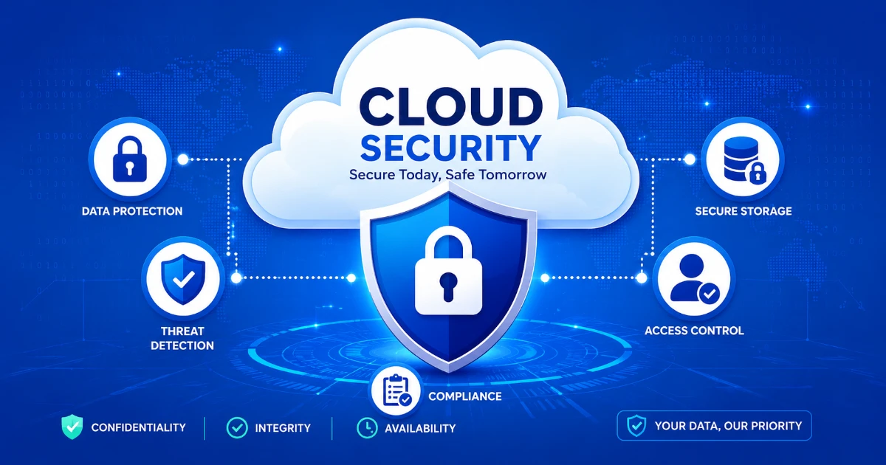

+++
title= "What Are the Best Cloud Security Solutions for Businesses?"
description= "This post answers a Quora question about the best cloud security solutions for businesses, with a practical full answer covering tools, controls, and priorities."
summary= "A full answer to a Quora question on the best cloud security solutions for businesses."
draft= false
showReadingTime = true
showWordCount = true
showTaxonomies = true
date = 2026-06-01T00:39:00+02:00
tags = ["Quora", "Cloud Security", "Cybersecurity", "AWS", "Compliance", "Business Security"]
categories = ["Quora Answers", "Cloud Security"]
sharingLinks = ["email","reddit","telegram","twitter","linkedin"]
sourceUrl = "https://www.quora.com/What-are-the-best-cloud-security-solutions-for-businesses"
source = "Quora"
+++

>[!NOTE]
> 

You have to think of cloud as your IT infrastructure but it's on the "Cloud". 

The cloud providers typically are responsible for securing their data centers. However, depending on what layer you chose, you are responsible for securing the layers that you control. If you're using IaaS (e.g. AWS EC2), then you're responsible for patching your instances and also securing whatever is running on it. If you're using PaaS (e.g. AWS Elastic Beanstalk), you have to secure access, data, configurations,secrets and the code that is running on it. Usually, IaaS requires more work than PaaS and SaaS with SaaS being the least amount of work (unless you are the SaaS provider).

The best cloud security solution is following industry standards and regularly auditing your security controls.

1. When it comes to IAM, principle of least privilege and enforcement of role based access.
2. Auditability and traceability using cloudtrail in case of AWS.
3. Set up GuardDuty and make sure to set up notification rules and regularly monitor the logs for anomalies. 
4. You will always have errors in an application or system; classify those problems to reduce alert fatigue and treat unclassified problems as a risk since those could be symptoms of a security vulnerability.
5. If you follow the zero trust approach, treat every surface as potential attack surface. Then you need to think of threat modeling.
6. Data classification is also as important as all of the above. You can't secure what you can't see. This is a challenge when it comes to unstructured data. However, today most cloud providers offer solutions to detect sensitive data using LLM (I would not have that as first go solution).

Cloud security is very broad and configurations depend on so many factors and each business have different risk tolerance and business requirements as well as legal and regulatory environments can be a journey.

This is why companies hire cloud consultants or experts on the matter because it's a whole field of it's own.