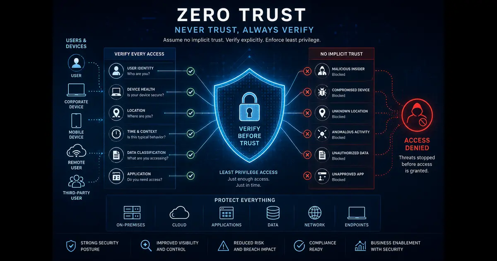

+++
title= "How Does Zero Trust Cloud Security Work?"
description= "This post answers a Quora question about how zero trust cloud security works, with a practical full answer covering principles, architecture, and implementation."
summary= "A full answer to a Quora question on how zero trust cloud security works."
draft= false
showReadingTime = true
showWordCount = true
showTaxonomies = true
date = 2026-06-04T04:55:00+02:00
tags = ["Quora", "Zero Trust", "Cloud Security", "Cybersecurity", "AWS", "Network Security"]
categories = ["Quora Answers", "Cloud Security"]
showTableOfContents = true
showDate = true
showDateUpdated = true
showAuthor = true
showBreadcrumbs = true
showHeadingAnchors = true
showPagination = true
showSummary = true
sharingLinks = ["email","reddit","telegram","twitter","linkedin"]
sourceUrl = "https://www.quora.com/How-does-zero-trust-cloud-security-work"
source = "Quora"
+++

 

>[!NOTE]
> 

According to Zero Trust principles, assume every surface is vulnerable and do not trust without verification. It allows specific traffic while denying all others.

>[!IMPORTANT]
>When it comes to cloud, we can't talk about zero trust without talking about ***Microsegmentation***.

Microsegmentation is a network security technique where each application, device or workload is protected by granular security zones. Similar to VLANs but more granular. Microsegmentation is achieved using a combination of firewalls, security groups, VPCs (AWS), roles and other security services.

Great example is when you separate each department in an organization by creating dedicated VPC for each (alongside security groups, NACLs and routing).

Such techniques achieve the following:
1. Reduced attack surface. (Prevents East-West attack movements)
2. Protecting critical applications.
3. Better regulatory compliance.
4. Easier maintenance and management of each asset.

One of the biggest challenges of achieving Zero Trust is when there is a conflict between Zero Trust principles and business requirements including lifecycle policy management.