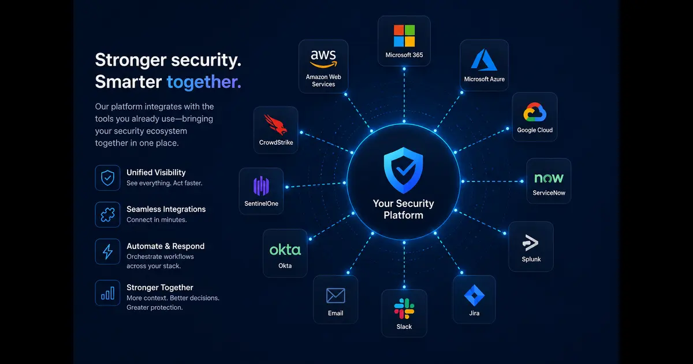

+++
title= "How Important Is It for Cybersecurity Products to Have Integrated Network, Cloud, Identity, and AI Security Solutions?"
description= "This post answers a Quora question about why integrated cybersecurity platforms matter, covering network, cloud, identity, and AI security in one unified approach."
summary= "A full answer to a Quora question on the importance of integrated cybersecurity solutions across network, cloud, identity, and AI."
draft= false
showReadingTime = true
showWordCount = true
showTaxonomies = true
date = 2026-06-03T03:36:00+02:00
tags = ["Quora", "Cybersecurity", "Cloud Security", "Identity Security", "AI Security", "Network Security", "Platform Security"]
categories = ["Quora Answers", "Cybersecurity"]
sharingLinks = ["email","reddit","telegram","twitter","linkedin"]
sourceUrl = "https://www.quora.com/How-important-is-it-for-cybersecurity-products-to-have-integrated-network-cloud-identity-and-AI-security-solutions"
source = "Quora"
+++

> 

 

>[!NOTE]
> 

Does it matter? Yes. Is it compulsory? No.

*Why it matters*:
When you have a solution that has for example identity and AI integrated together, it makes response to suspicious activities or compromised identities a lot faster. In essence, having multiple integrations in one product helps address potential blind spots.

As more companies are adopting zero trust, it becomes essential to have those integrations because each surface is treated as a vulnerability. For example, imagine that you want to verify that sensitive actions are both authenticated and authorized, it would be difficult to implement without having some level of integration with identity solutions and network monitoring solutions.

When you say cybersecurity products, you need to be more specific because anti virus software is also a cybersecurity product.

Generally speaking, if you are talking about enterprise cybersecurity products in an organization with 1000s of users, then by ideally, identity should be integrated specially when it comes to BYOD.

If the product is for example related to monitoring network activities, then you need network integration.

Speaking of cloud, it's hard nowadays to imagine anything that runs purely on premise so I'd say if a product is not cloud friendly or lacks cloud integrations, it's definitely a red flag since most enterprises are using cloud solutions.

AI fits very well in monitoring suspicious network activities so it's very suitable for products that specialize in that.

Now, can we have all of those in one cybersecurity solution? Absolutely! Many providers today like AWS offer many services that cover all companies' needs but they require proper configuration.

>[!NOTE]
>AI integration is still relatively new. So while it's useful as a tool at some point, it can also lead to failures due to overconfidence.

There are a lot of cybersecurity products nowadays and very strong competition among the providers, so in case you're thinking of offering cybersecurity products, you will need to have strong differentiation.

As per my personal experience, providers sometimes add half baked features in order to be competitive, but I've seen those half baked solutions cause more harm than good. This is a pain area for a lot of companies because they get very competitive prices without realizing that they are going to be the beta testers.

I'd say, I'd rather bet on a well established product with limited features rather than buying all in one products because some of them end up doing poorly on all of them.

If you have a product that has identity integration but its AI generates a lot of false positive alerts which causes work stoppages, then it's definitely better not to have it.