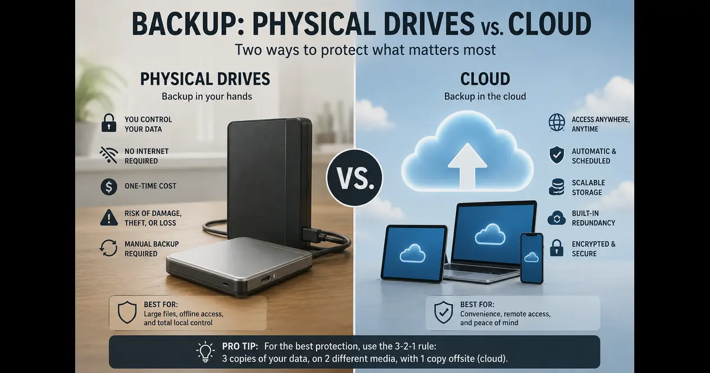

+++
title= "Is Backing Up to Multiple Drives Safer Than Cloud Storage?"
description= "This post answers a Quora question comparing the safety of backing up to multiple physical drives versus cloud storage for data protection."
summary= "A full Quora answer explaining the advantages and disadvantages of multiple drive backups versus cloud storage for data security."
draft= false
showReadingTime = true
showWordCount = true
showTaxonomies = true
date = 2026-06-05T05:18:00+02:00
tags = ["Quora", "Data Backup", "Cloud Storage", "Multiple Drives", "Data Security", "Backup Strategy", "Physical Storage"]
categories = ["Quora Answers", "Cloud Security"]
sharingLinks = ["email","reddit","telegram","twitter","linkedin"]
question = "Is backing up to multiple drives safer than cloud storage?"
source = "Quora"
sourceUrl = "https://www.quora.com/unanswered/Is-backing-up-to-multiple-drives-safer-than-cloud-storage"
+++

 

>[!NOTE]
> 

It depends on your risk management approach. If you put all the physical drives together in one spot, then the answer is no.

A better approach would be "Hybrid". Store your data on physical drives and have a well encrypted backup on the cloud.

Most cloud providers have measures to ensure that your data won't be lost if a data center went down or if they had hardware failures.

The real risk of backing data on the cloud mostly boils down to whether or not you chose a good cloud provider and if you configured protection properly.

It is possible for instance to have encrypted backups on the cloud but never share or store the decryption keys on the cloud.

You need also to take into account environmental factors about the physical location of your drives. If your area is known for having floods, storms, tornadoes, etc..., then well positioned cloud providers can help you mitigate the risk.

Hardware drives are made of metal materials that overtime do degrade so even if you won't touch your drives for many years, if the environment where they are stored is not well maintained, the drives might fail. Of course, this is not a common scenario when it comes to the hardware, but I'm trying to point out that there is no risk free option. 

If you ask me about industry best practices, follow the 3-2-1 backup rule (3 copies, 2 different media and 1 offsite).