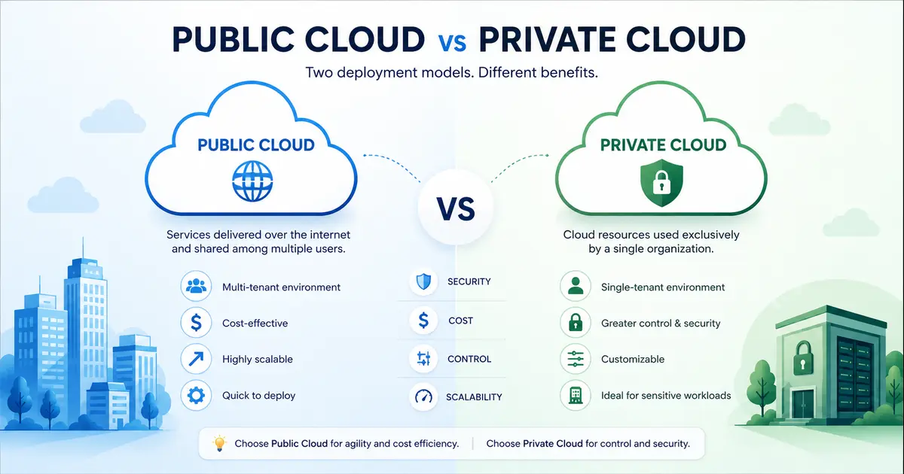

+++
title= "Public vs Private Cloud"
description= "This post answers a Quora question about the advantages of private cloud versus public cloud for company data centers and server environments."
summary= "A full Quora answer explaining the advantages of private cloud over public cloud for business infrastructure."
draft= false
showReadingTime = true
showWordCount = true
showTaxonomies = true
date = 2026-06-01T01:39:00+02:00
tags = ["Quora", "Private Cloud", "Public Cloud", "Cloud Security", "Infrastructure", "Data Center"]
categories = ["Quora Answers", "Cloud Security"]
sharingLinks = ["email","reddit","telegram","twitter","linkedin"]
question = "What are the advantages of using a private cloud over a public cloud for a company's data center or server environment?"
source = "Quora"
sourceUrl = "https://www.quora.com/What-are-the-advantages-of-using-a-private-cloud-over-a-public-cloud-for-a-companys-data-center-or-server-environment"
+++

> 

>[!NOTE]
> 

For most businesses, private cloud is considered an overkill since the costs of private cloud can be prohibitive for general commercial businesses that do not handle much sensitive data.

The main problem or concern about public cloud is multi-tenancy. This means that for example if you're renting a server (e.g. EC2 in AWS), you're not getting a whole machine in AWS data center but instead a chunk (virtual machine). The other portions are used potentially by other customers.

The risk boils down to how well the virtual machines are isolated. A mistake or hole in the virtualization layer can be a serious risk. This is why most cloud providers offer VPC solutions or virtual private cloud where you can achieve similar results but you have more control using security groups, IAM policies, routing, encryption, etc... 

Private cloud is often used for regulated industries such as healthcare, financial institutions and government. Many cloud providers also offer private cloud packages which is more cost-effective than building your own data center. 

Unfortunately, building a data center isn't enough because you still need to have business and disaster recovery plans. When you build a data center, you run all the risks of a cloud provider in addition to your business risks. This is why private cloud is uncommon for typical businesses.
