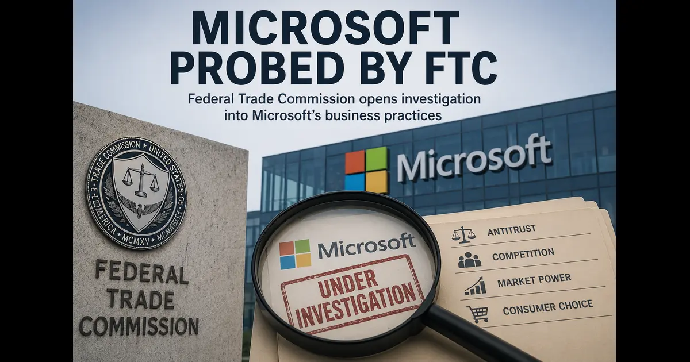

+++
title= "Microsoft's Azure Antitrust Investigation: What This Means for Cloud Competition"
description= "The FTC is probing Microsoft for exclusionary behavior in Azure cloud services and AI industry dominance. Here's what this means for cloud competition and infrastructure strategy."
summary= "An analysis of the FTC's antitrust investigation into Microsoft's Azure cloud services and AI industry practices, examining vendor lock-in and market consolidation concerns."
draft= false
showReadingTime = true
showWordCount = true
showTaxonomies = true
date = 2026-06-05T04:56:00+02:00
tags = ["Microsoft Azure", "Antitrust", "FTC", "Cloud Competition", "AI Infrastructure", "Vendor Lock-in", "Industry Analysis"]
categories = ["Industry Analysis", "Cloud Security"]
sharingLinks = ["email","reddit","telegram","twitter","linkedin"]
question = "What are your reactions to Microsoft's potential exclusionary behavior in its Azure cloud services and its role in the AI industry?"
source = "Quora"
sourceUrl = "https://www.quora.com/unanswered/What-are-your-reactions-to-Microsofts-potential-exclusionary-behavior-in-its-Azure-cloud-services-and-its-role-in-the-AI-industry"
+++

> 

 

>[!NOTE]
> 

Honestly speaking, I’m not surprised about this. Actually, every cloud service provider has locked in their customers with a service or terms that make it difficult to switch. Therefore, this is not unique to Microsoft. However, what’s concerning to me is, if demand on data centers generated by OpenAI was all controlled by one entity (Microsoft). This means that Microsoft made it harder for other service providers to offer more efficient or more environmentally friendly data center solutions since AI does require data centers.

FTC's main concern is that Microsoft's deal with OpenAI in 2019 has barred other workload providers from competing with Azure potentially negatively impacting fair competition, innovation and sustainability.