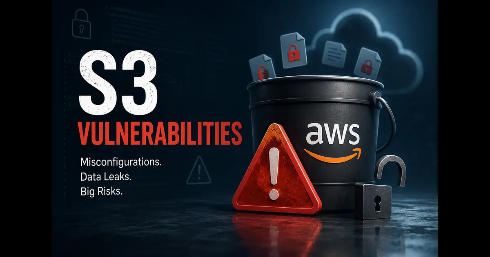

+++
title= "What Typical Vulnerabilities in AWS S3 Buckets Lead to Accidental Data Exposure?"
description= "This post answers a Quora question about common AWS S3 vulnerabilities that result in unintended public exposure of sensitive data, with practical insights and prevention strategies."
summary= "A full answer to a Quora question on AWS S3 bucket misconfigurations and data exposure risks."
draft= false
showReadingTime = true
showWordCount = true
showTaxonomies = true
date = 2026-06-02T09:36:00+02:00
tags = ["Quora", "AWS", "S3", "Cloud Security", "Data Exposure", "Misconfiguration", "Security Best Practices"]
categories = ["Quora Answers", "Cloud Security"]
sharingLinks = ["email","reddit","telegram","twitter","linkedin"]
sourceUrl = "https://www.quora.com/unanswered/What-typical-vulnerabilities-do-AWS-S3-buckets-have-that-allow-AWS-users-to-accidentally-expose-sensitive-information-to-the-public"
source = "Quora"
+++

> 



>[!NOTE]
> 

The most common problem or scenario that S3 users encounter is that they need their applications to access an object that is hosted on S3 bucket and during development stages, they either directly or indirectly make the S3 objects public without realizing.

This is why, AWS have made it possible for VPCs to access S3 buckets using Gateway Endpoints as an alternative to using public URLs over the public web and for scenarios where S3 users for example want to share files only to subscribers or premium customers, they can use pre-signed URLs with an expiry date or time.

Another scenario where S3 buckets get exposed is due to over permissive IAM role policy like in the example below. This is why professionals often setup restrictive SCPs to limit what accounts could access as a guardrail.

```json
{
  "Effect": "Allow",
  "Action": "s3:*",
  "Resource": "*"
}
```

If the service or account given unlimited access to the S3 bucket is compromised, an attacker can simply access all the bucket's contents. This is why it's better to give limited access to S3 buckets and when possible to create multiple buckets depending on data sensitivity.

Other than that, a compromised user with open access to S3 or admin access is another possibility.

S3 buckets' vulnerabilities are mainly misconfigurations or lack of training.

Last but not the least, S3 buckets normally have a setting called "Block Public Access". This is the top vulnerability as disabling it or misconfiguration of this setting can expose the entire bucket to the internet. There is no telling how much time it takes for bots and crawlers to hit it if it's not enabled at creation or before any objects are stored in the bucket.

All of the above are few common examples. There are many other common mistakes or scenarios where S3 buckets get exposed. This is why, it's crucial for organizations to invest in training their staff or employees on how to handle S3 buckets securely.