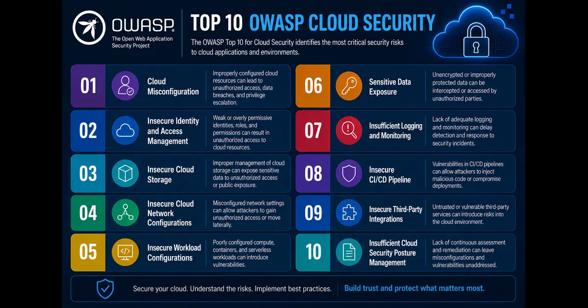

+++
title= "Why Is Cloud Security Such a Challenge?"
description= "This post answers a Quora question about why cloud security is such a challenging problem, with a practical full answer covering complexity factors, risks, and mitigation strategies."
summary= "A full answer to a Quora question on why cloud security is such a challenge."
draft= false
showReadingTime = true
showWordCount = true
showTaxonomies = true
date = 2026-06-09T00:39:00+02:00
tags = ["Quora", "Cloud Security", "Cybersecurity", "AWS", "Compliance", "Risk Management"]
categories = ["Quora Answers", "Cloud Security"]
sharingLinks = ["email","reddit","telegram","twitter","linkedin"]
sourceUrl = "https://www.quora.com/Why-is-cloud-security-such-a-big-challenge"
source = "Quora"
+++

> 

>[!NOTE]
> 

There are many reasons that make cloud security more challenging than traditional on-premise security.

In essence, the following factors play a huge role:
1. On public cloud, you're renting infrastructure from another company.
2. On public cloud, you have no say over what security measures the cloud provider has for their data centers.
3. Cloud security requires deeper networking expertise beyond simply the server vs. client model.
4. The fundamentals of cloud computing require making data and services accessible remotely via internet which carries alongside all the risks associated with the internet.
5. Lack of training and expertise in cloud technology is the primary cause behind misconfigurations which lead to either data loss or breaches.

The above, of course, is not an extensive list. OWASP has listed the following top 10 risks:
1. Cloud Misconfiguration
2. Insecure Identity and Access Management (IAM)
3. Insecure Cloud Storage
4. Insecure Cloud Network Configurations
5. Insecure Workload Configurations
6. Sensitive Data Exposure
7. Insufficient Logging and Monitoring
8. Insecure CI/CD Pipeline
9. Insecure Third-Party Integrations
10. Insufficient Cloud Security Posture Management (CSPM)

In addition to all of the above, regulated industries require adhering to several standards such as the PCI-DSS and HIPAA. Therefore, it is not enough to secure your cloud; you also need to have adequate logging, monitoring, policies and controls in place. While on-premise also requires compliance with the same standards, on the cloud, it's more complex since except the endpoints made available to the cloud consumers, you sometimes need to ask the cloud provider for extra logs as well as cooperation with legal holds during investigations by authorities.

Why do companies still bother with all of these complexities? It is very efficient since you only pay for what you use, and you don't need to handle constant hardware procurement and all the overhead entailed.