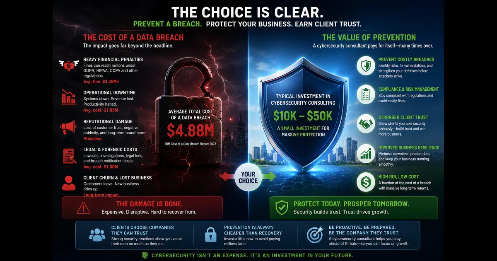
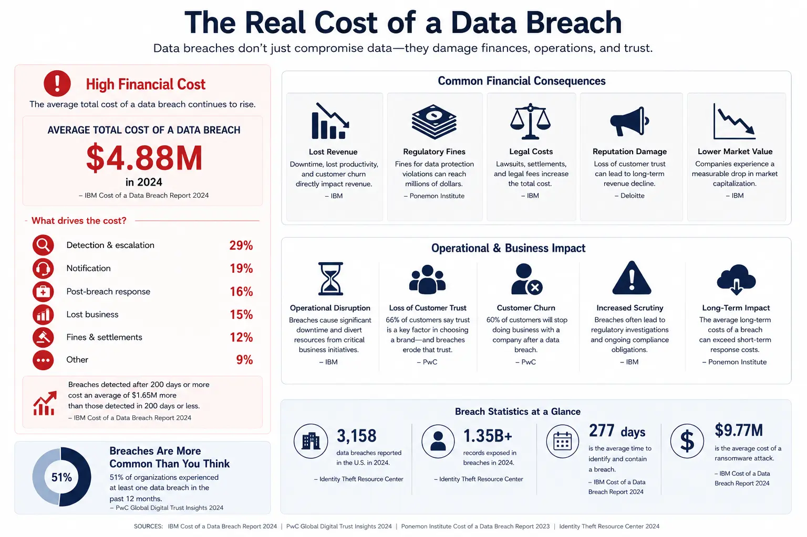

+++
title = "\"We're Too Small to Be Targeted\" is Why They Never Saw It Coming"
description = "SMBs experience more severe impacts of cyber incidents due to their limited resources."
summary = "The dangerous assumption that SMBs are too small to be targeted leads directly to data breaches. This post explains why cybercriminals specifically target small businesses, how this misconception causes SMBs to skip hiring security consultants, and the critical protections needed to prevent breaches."
draft = false
showReadingTime = true
showWordCount = true
showTaxonomies = true
date = 2026-06-19T08:00:00+02:00
tags = ["SMB Security", "Cloud Security", "AWS Security", "Data Breaches", "Security Consulting", "GDPR", "PCI-DSS", "Zero Trust", "Risk Management", "S3 Misconfiguration"]
categories = ["Cloud Security", "SMB Security", "Data Breach Prevention"]
sharingLinks = ["email", "reddit", "telegram", "twitter", "linkedin"]
showTableOfContents = true
+++

> 

A [2025 survey by the UK government](https://www.gov.uk/government/statistics/cyber-security-breaches-survey-2025/cyber-security-breaches-survey-2025#chapter-4-prevalence-and-impact-of-cyber-breaches-or-attacks), it was found that 41% of micro-businesses and 50% of small businesses have experienced either an attack or a data breach.

In another [2025 study by the University of Maryland](https://www.rhsmith.umd.edu/news/small-business-still-means-big-risk-listen-economists), small businesses are at much higher risk of a financial disaster given their limited resources in contrast to big corporations that are already spending millions of US dollars on their cybersecurity posture. In the US, 99% of the companies are considered SMBs (based on US chamber of commerce data).

>[!NOTE]
>Cybercriminals may find SMBs more attractive as a target compared to big corporations given the low effort required.

Many SMBs view hiring an expert in cybersecurity as high cost, so they rely instead on their undertrained staff to handle cybersecurity. The harsh reality is that cybersecurity is a broad and specialized field that is distinct from the software engineering discipline which makes it hard for someone with a traditional software engineering background to perform proper threat modelling and propose appropriate policies and controls to lower or mitigate common risks. The same can also be said about traditional DevOps Engineers.

Most employees lack training on how to recognize a phishing attack or best practices to protect customer data from accidental leakage or breaches.

Even with cyber insurance, there is no guarantee that an incident will fall under the insurance policy's coverage. Nevertheless, the damage a business can sustain from a data breach can permanently destroy it especially when customer trust is required. All US states have breach notification laws with varying scopes and timing (without unreasonable delay). As for fines, in New York for example, the fine can be $20/record (max USD 250k). In California, the fines can range from USD 2.5k to 7.5k per violation (without cap). The penalties under HIPAA are even bigger going up to USD 1.5m annually.

As a cybersecurity professional coming from a software engineering background, I know that cybersecurity risks are treated as an afterthought for real due to multiple factors starting with business priorities to lack of training and awareness.

SMBs don't actually need to hire an entire team of cybersecurity professionals or pay huge amounts of money to big consulting firms. They can instead hire consultants with scoped engagements.

Companies can treat the costs of obtaining and maintaining ISO 27001 certification and good standing as a marketing cost since clients are becoming more sensitive to the security of their data since we live today in the digital era (soon AI era). Gold is no longer stored in a closet but as numbers in a database on a server.

The cost of cybersecurity consultancy remains minor to the cost of a major data breach as well as PR management and asking your marketing teams and sales to handle the aftermath.