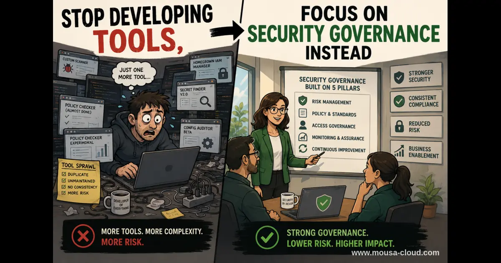

+++
title = "Stop Developing Tools, Focus on Security Governance Instead"
description = ""
summary = "Organizations overinvest in security tools while underinvesting in governance. This post explains why security governance drives better outcomes than tool proliferation and how to implement it effectively."
draft = false
showReadingTime = true
showWordCount = true
showTaxonomies = true
date = 2026-06-13T08:00:00+02:00
tags = ["Security Governance", "Cloud Security", "AWS Security", "AI Security", "Compliance", "GDPR", "PCI-DSS", "Zero Trust", "Risk Management", "Policy Management"]
categories = ["Cloud Security", "Security Governance", "AI Security & Governance"]
sharingLinks = ["email", "reddit", "telegram", "twitter", "linkedin"]
showTableOfContents = true
lastMod = 2026-06-19T08:00:00+02:00
+++

> 

I have been observing the landscape recently in cybersecurity and the more time I spend on tech communities, the harder it becomes to recognize a pattern.

I see every day and every few minutes something along the lines of "Check out my new cool tool that automates ABC" or "I created a free assessment tool that will check all your controls and tell you XYZ" and so on.

## Simple Automation Mindset No Longer Stand Out

Unfortunately, we are still stuck on a mindset during the pre-AI era about how cool automation is and how valuable our coding skills are. However, the blind spot a lot of tech professionals today are missing is that the value proposition of automation no longer helps you stand out.

With AI, generating code or automating certain tasks became so easy that the bar for generating prod ready tools is almost non-existent at this point (except for software that solves complex problems).

> Jensen Huang (NVIDIA CEO)
> 
> "It is our job to create computing technology such that nobody has to program, and the programming language is human."
> — February 2024, World Government Summit in Dubai

> Sam Altman (OpenAI CEO)
> 
> "I have so much gratitude to people who wrote extremely complex software character-by-character. It already feels difficult to remember how much effort it really took. Thank you for getting us to this point."
>— Sam Altman, posted on X (Twitter), March 2026

> Dario Amodei (Anthropic CEO)
> 
> "I have engineers within Anthropic who say I don't write any code anymore. I just let the model write the code, I edit it."
> — Dario Amodei, World Economic Forum in Davos, January 2026

It is naive to think that an industry projected to reach USD 1 trillion dollars by 2027 will disappear overnight or that they will face an obstacle and give up. Those are companies with massive investments so failure is not in their dictionary. As of today, the AI market have reached USD 617.62bn (according to [Statista](https://www.statista.com/outlook/tmo/artificial-intelligence/worldwide/#market-size)).

The above doesn't only apply to Software Engineering but also to Cybersecurity as well.

## AI Tokens Cost Vs. Hiring Humans

It was already known that AI companies were largely running at a loss for a few years, and now we see that the overall cost of running AI agents has increased dramatically due to high adoption and hunger for compute power (https://www.businessinsider.com/openclaw-ai-demand-token-use-surge-nvidia-pricing-jumps-2026-2). Rumors suggest that we will go back to hiring humans instead of relying on AI but there is a huge flaw in this argument.

AI, like every technology, is always costly and not so efficient at the beginning. It only takes a breakthrough before we see the tokens' prices become a lot cheaper. Therefore, the idea that suddenly tokens prices are going to turn back industries away from AI and into hiring humans like they used to in the past is maybe true for the short term but less likely to remain a reality.

A well-developed LLM can spot vulnerabilities and threats much faster than a human can do no matter how fast they work. A vulnerability that takes a Security Engineer to spot and patch in hours can be done by AI within minutes. This significantly reduces the cost per hour for companies.

> [!IMPORTANT]
> AI security solutions do require human intervention and maintenance. Companies still need AI Security and Governance specialists.

## The Market Is Flooded with SIEM Solutions and Tools

According to an IDC survey, organizations on average are dealing with 10 to 15 security vendors and 60 to 70 security tools (Source: IDC survey, as reported by CrowdStrike, 2024).

If anything, companies are trying to actually slash down the number of tools and even encouraging their internal engineers not to create any additional tools without an internal review process. This is based on my personal observation across multiple industries.

Is it important that you can write a script or create some tool? Of course! The point is that, you need to take into account that when you step into a tech company, your script or tool might work only in the short-term for a problem that the organization may consider not worth buying a SaaS solution for.

From my personal experience in big tech, I had to pause sometimes to think which tool to use since each company had dozens in production (even if they didn't really want them).

## Why Security Engineering Mindset Is Better Than Automation

The value of developing a tool to check policy violations is very weak if the architecture itself is flawed.

Quite often, you'll find problems that can be solved by a configuration tweak without writing a single piece of code.

You might, for example, be tempted to restrict access to AWS S3 and develop a service that stands between the customer and the bucket to ensure only authorized access when all you had to do was simply enable pre-signed URLs.

Another example: you could be tempted to develop a tool to revoke access of AI agents when a more pragmatic approach could have been granting AI agents authorization tokens with TTLS instead.

Sometimes, the problem is not collecting regulated data but the lack of secure design. If your organization can fill a gap by simply enabling encryption when a client inputs their data into a form, would you still try to develop a new tool?

## Security and Governance

What was discussed above is only part of security and governance; and if I'm to cover every aspect of security and governance, I'd probably need more than just a blog post to cover them.

Security and governance is a broad topic but a cybersecurity professional who is proficient in a few of its aspects can offer more value than an engineer who can write a for loop.

Below is a non-exhaustive list of topics that fall under security and governance:

1. Policies (with leadership backing)
2. Compliance (e.g. GDPR, PCI-DSS, ISO 27001, etc...)
3. Accountability (who owns what)
4. Standards
5. Audit processes (verifying controls and compliance)

You can offer an organization a much stronger value proposition, if you can for example advise their dev team on how to handle PII in their code.

## When to Develop New Tool

If you wish to develop a new tool, try to ask yourself the following questions:

1. What problem exactly I'm trying to solve?
2. Have someone already made something similar?
3. If I were a client, is the value proposed compelling enough that I'd spend thousands of US dollars for?
4. Will my tool do something that AI and other LLMs cannot do no matter what?

You can perform a simple smoke test by simply running a search on any search engine of your idea and see if it already exists.

There are genuinely situations where organizations have neither the time nor resources to acquire a new SaaS solution for a specific problem, and you may be asked to solve it using automation or custom script but more often than not, your tool will be replaced later on by a SaaS provider who has signed an SLA with blood, and they have 24/7 dedicated teams for support. SaaS providers need to meet standards and regulations such as the ISO 27001 and have a strong track record.

## Conclusion

I must emphasize that I'm not saying that developing tools is wrong or bad. What I'm trying to prompt is change of mindset. The question or challenge of today is no longer "How can I automate this?", but rather, "How can I create systems that are scalable, efficient, resilient and secure".