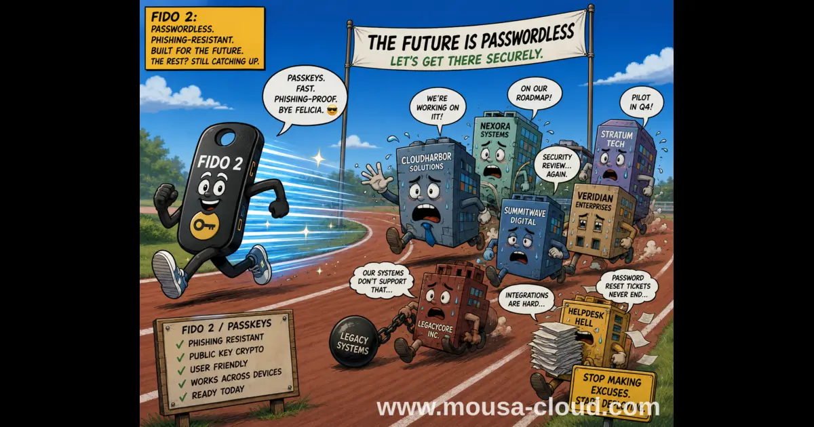

+++
title = "Why Organizations Are Still Missing Out on Passwordless Adoption"
description = "Despite passwordless authentication offering superior security against phishing and credential theft, 76-86% of organizations haven't fully adopted it. Explore the key barriers: cost, legacy systems, user experience concerns, and lack of awareness. Learn how to overcome these obstacles and implement passwordless authentication in your cloud environment."
summary = "Despite passwordless authentication's superior security benefits, 76-86% of organizations haven't fully adopted it. This post explores the key barriers preventing passwordless adoption and how to overcome them."
draft = false
showReadingTime = true
showWordCount = true
showTaxonomies = true
date = 2026-06-08T08:00:00+02:00
tags = ["Passwordless Authentication", "Cloud Security", "AWS Security", "Identity Management", "IAM", "Cybersecurity", "MFA", "Zero Trust", "Phishing Resistance", "Authentication"]
categories = ["Cloud Security", "Identity & Access Management", "Security Best Practices"]
sharingLinks = ["email", "reddit", "telegram", "twitter", "linkedin"]
showTableOfContents = true
+++

> 

According to a [2024 study by Ponemon-Sullivan Privacy Report](https://ponemonsullivanreport.com/2024/11/the-2024-study-on-the-state-of-identity-and-access-management-iam-security/), it was found that around 76% of organizations surveyed in the US haven't adopted passwordless yet.

Given the rapidly evolving landscape of the internet and AI, the lag in adopting passwordless is a concern worthy of highlighting.

### Passwords Are Not Enough Anymore

Hackers have figured out long ago, many ways to obtain passwords. All it takes for an account to be compromised, is one vulnerable service running on a server or side channel attacks and the password would already be sold on the dark web for the highest bidder.

Despite the fact that many organizations have raised the baseline password's complexity to comply with the standards and regulations, there are still other challenges:

1. Password rotation fatigue employees who may not be very tech-savvy (or use password managers), so they resort to workarounds that could compromise their passwords.
2. How passwords are stored cannot be ignored.
3. Security level among applications that do use passwords can be inconsistent. This means for example, your banking application might be very secure but this may not be true if you're using the same password for a partner site or service.
4. Even passwords that are encrypted at rest can be compromised if the encryption algorithm is weak or contain vulnerabilities.
5. Hackers often use social engineering to try to guess passwords using password cracking tools. Short and predictable passwords can be cracked anywhere in seconds to a few minutes.

What makes relying on passwords only even more risky, is that around 80% of organizations haven't adopted yet zero trust architecture which means that all it takes is one compromised password or account and hackers can install malware to extract others' passwords (APT). This is as per the same study by Ponemon-Sullivan Privacy Report in 2024. 

The above scenarios of course assume that users do not have adequate 2FA configured or their 2FA channels are also compromised (e.g. zero-click attacks on mobile devices).

### How Does Passwordless Solve The Problem?

Passwordless implementations such as FIDO2 for example significantly reduce the risks associated with passwords handling because the passwordless device itself becomes the authenticator. This can come in the form of BYOD or for example hardware security keys (e.g. Yubikeys are a popular solution).

When you enroll a passwordless compatible device, the device generates private and public keys. The private key which contains the secret (random number) never leaves the device or cannot be extracted. In addition the private key is calculated from the web service domain alongside the secure secret generated.

>[!TIP]
>Since the private key uses the web service domain alongside the secret, this makes phishing attacks much harder.

Since each login uses a different random challenge signed with the private key, replay attacks become useless.

Some passwordless authenticators may also be compatible with biometric authentication such as face recognition or finger prints which reduces theft risks.

Examples of passwordless solutions:
1. FIDO2 (Fast Identity Online) -> ***Most secure***
2. OTP (One Time Password)
3. Biometric Authentication.
4. Magic Links (one-time links)
5. Mobile App-Based
6. Third-Party Identity Providers (e.g. Azure AD, Okta and Ping Identity)
7. Certificates and Tokens
8. Physical Tokens

### Why Organizations Are Lagging Behind?

The main challenge organizations still face in passwordless's adoption is account recovery. If passwords are phased out without having reasonably secure options for account recovery, there is a significant risk of access loss.

Other factors contributing to the slow adoption such as legacy systems and employees getting overwhelmed with the change.

### No Standard Account Recovery Solution

As of today, organizations are implementing different procedures for account recovery. For example, some organizations would require the employee to come personally to the workplace in order to restore access. Others provide for example hotlines where they get asked different challenge questions and need to execute one extra step to restore their access.

### Why Organizations Need to Prioritize Passwordless

Since secrets never leave the device in case of FIDO2, it's much harder for attackers to extract the secrets and use them.

>[!NOTE]
>While most passwordless compatible devices are secure, this doesn't mean that side channel attacks are impossible. For instance, during testing, NinjaLab found a vulnerability (EUCLEAK) in the cryptographic library that made it possible for them to clone the key. Yubico advised users to either upgrade or purchase newer, patched version of Yubikeys.

Transitioning the organization to passwordless standards requires both technical expertise and most importantly the backing of leadership and dedicated effort when it comes to dealing with legacy systems. Quite often, organizations would try instead to deprecate incompatible systems in favor of building or buying licenses for compatible ones.